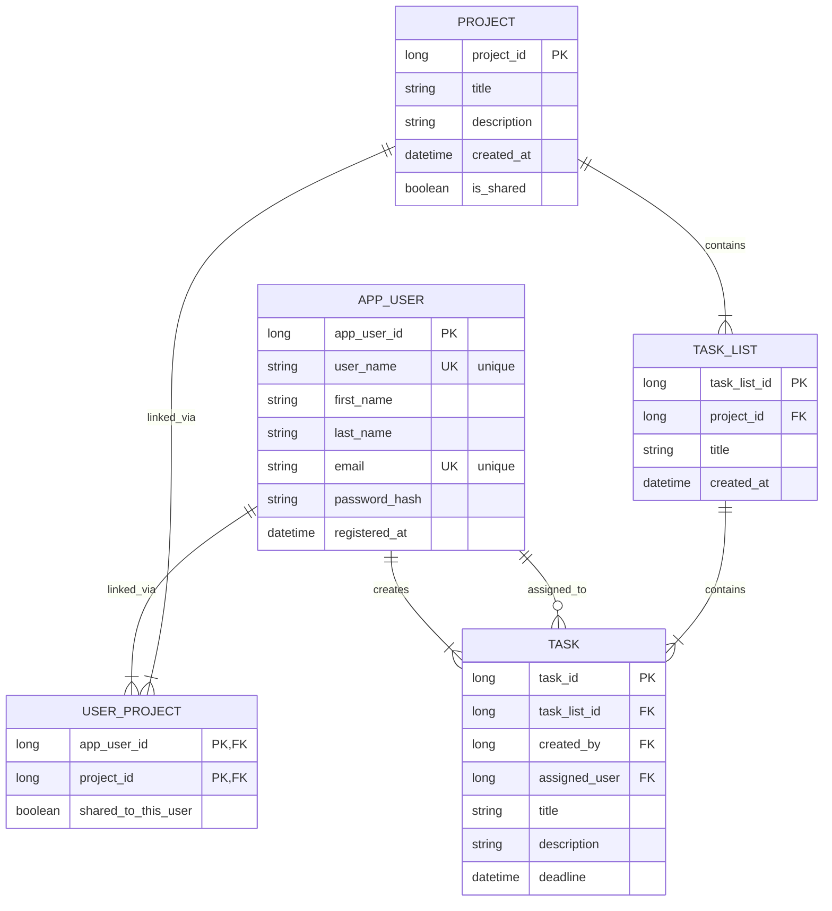

# Prokress

[](https://www.java.com)
[](https://spring.io/projects/spring-boot)
[](https://www.postgresql.org)
[](https://www.docker.com)
[](https://github.com/Git-Happens-HH/Project-management-backend/blob/main/LICENSE)
[](https://github.com)
[](https://github.com/Git-Happens-HH/Project-management-backend/actions)
[](https://github.com/Git-Happens-HH/Project-management-backend/actions)
[](https://github.com/Git-Happens-HH/Project-management-backend/actions)

## Project Name and Description

Prokress is a project management application designed to help teams manage projects, tasks, user roles, and work progress in one place. The application supports project creation, task lists, task creation, drag and drop task handling, user login, and real-time task tracking.

## Backlog

- GitHub Projects backlog: [Git-Happens-HH project 1](https://github.com/orgs/Git-Happens-HH/projects/1)

## Production Deployments

- Backend: [https://project-management-backend-prokress-backend.2.rahtiapp.fi/](https://project-management-backend-prokress-backend.2.rahtiapp.fi/)
- Backend Swagger UI: [https://project-management-backend-prokress-backend.2.rahtiapp.fi/swagger-ui/index.html](https://project-management-backend-prokress-backend.2.rahtiapp.fi/swagger-ui/index.html)
- Frontend: [https://yellow-mud-05a9abf03.1.azurestaticapps.net](https://yellow-mud-05a9abf03.1.azurestaticapps.net)

## License

This project is licensed under the MIT License - see the [LICENSE](https://github.com/Git-Happens-HH/Project-management-backend/blob/main/LICENSE) file for details.

## Technologies

- Java 21
- Spring Boot 3.5.14
- Spring Web
- Spring Data JPA
- Spring Data REST
- Spring Security
- JWT (JJWT 0.11.5)
- Spring WebSocket
- Spring Validation
- Springdoc OpenAPI / Swagger UI
- PostgreSQL 15
- H2 Database
- Maven
- Testcontainers 1.20.4
- JUnit 5
- Mockito

## Technical Instructions

The application is located in the Maven module [project-management-app](project-management-app).

### Running Locally on Windows

```powershell
cd project-management-app
./mvnw.cmd spring-boot:run
```

The application will start with the default profile using H2 in-memory database and will be accessible at `http://localhost:8080`.

**Access Swagger UI:** Open `http://localhost:8080/swagger-ui/index.html` to view all available REST API endpoints.

**H2 Console:** Access the H2 database console at `http://localhost:8080/h2-console` (default credentials: username `sa`, password `password`).

### Running Tests

```powershell
cd project-management-app
./mvnw.cmd test
```

**Note:** TestContainers tests require Docker to be installed and running. If Docker is not available, you can skip TestContainers tests using:

```powershell
cd project-management-app
./mvnw.cmd test -DskipTests
```

### Full Verification Build

```powershell
cd project-management-app
./mvnw.cmd clean verify
```

### Application Profiles

The application supports multiple Spring profiles for different environments:

- **default** (local development): Uses H2 in-memory database
- **rahti**: Uses PostgreSQL (for Rahti/OpenShift deployment) with health check endpoints enabled
- **testcontainer**: Uses PostgreSQL with TestContainers for integration testing

## REST API Documentation

All REST API endpoints are automatically documented in Swagger UI and can be accessed at:

- **Local:** `http://localhost:8080/swagger-ui/index.html`
- **Production:** `https://project-management-backend-prokress-backend.2.rahtiapp.fi/swagger-ui/index.html`

The API includes endpoints for managing users, projects, task lists, tasks, and comments with full CRUD operations and WebSocket support for real-time updates.

## Deployment

For production deployment information and CI/CD pipeline details, see:

- [CI/CD Documentation](docs/ci-cd-document.md) - Detailed information about GitHub Actions workflows, deployment strategies, and production rollout procedures
- OpenShift manifests in [ops/openshift/](ops/openshift/) - Kubernetes deployment configurations, services, and routes

The application is deployed to Rahti (OpenShift) with automated CI/CD pipelines that handle testing, security scanning, staging, and production deployment.

## Data Model

The core domain consists of the following entities:



## Attachments

- CI/CD documentation: [docs/ci-cd-document.md](docs/ci-cd-document.md)
- Testcontainers documentation: [docs/testcontainers.md](docs/testcontainers.md)
