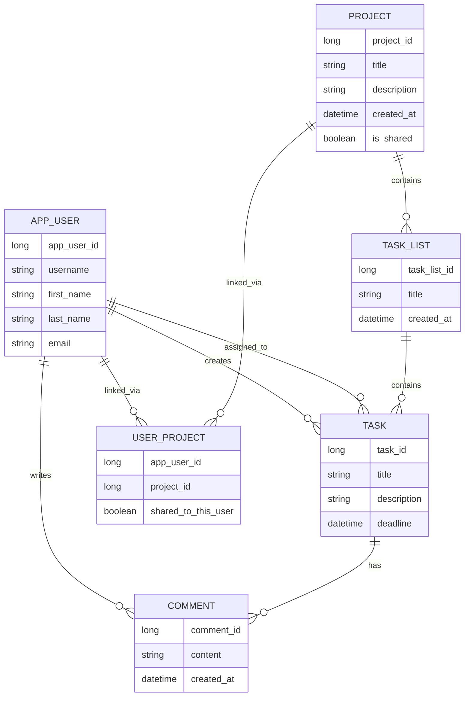

# Prokress - Project Management App

[](https://www.java.com)
[](https://spring.io/projects/spring-boot)
[](https://www.postgresql.org)
[](https://www.docker.com)
[](https://github.com/Git-Happens-HH/Project-management-backend/blob/main/LICENSE)
[](https://github.com)
[](https://github.com/Git-Happens-HH/Project-management-backend/actions)
[](https://github.com/Git-Happens-HH/Project-management-backend/actions)
[](https://github.com/Git-Happens-HH/Project-management-backend/actions)

## Project Name and Description

Prokress is a project management application designed to help teams manage projects, tasks, user roles, and work progress in one place. The application supports project creation, task lists, task creation, drag and drop task handling, commenting, user login, and real-time task tracking.

## Backlog

- GitHub Projects backlog: [Git-Happens-HH projects](https://github.com/orgs/Git-Happens-HH/projects)

## Production Deployments

- Backend: [https://project-management-backend-prokress-backend.2.rahtiapp.fi/](https://project-management-backend-prokress-backend.2.rahtiapp.fi/)
- Backend Swagger UI: [https://project-management-backend-prokress-backend.2.rahtiapp.fi/swagger-ui/index.html](https://project-management-backend-prokress-backend.2.rahtiapp.fi/swagger-ui/index.html)
- Frontend: [https://yellow-mud-05a9abf03.1.azurestaticapps.net](https://yellow-mud-05a9abf03.1.azurestaticapps.net)

## License

This project is licensed under the MIT License - see the [LICENSE](https://github.com/Git-Happens-HH/Project-management-backend/blob/main/LICENSE) file for details.

## Technologies

- Java 21
- Spring Boot 3.5.14
- Spring Web
- Spring Data JPA
- Spring Data REST
- Spring Security
- JWT (JJWT 0.11.5)
- Spring WebSocket
- Spring Validation
- Springdoc OpenAPI / Swagger UI
- PostgreSQL 15
- H2 Database
- Maven
- Testcontainers 1.20.4
- JUnit 5
- Mockito

## Technical Instructions

The application is located in the Maven module [project-management-app](project-management-app).

Run locally on Windows:

```powershell
cd project-management-app
./mvnw.cmd spring-boot:run
```

Run tests from the command line:

```powershell
cd project-management-app
./mvnw.cmd test
```

Run the full verification build:

```powershell
cd project-management-app
./mvnw.cmd clean verify
```

## Data Model

The core domain consists of the following entities:



## Attachments

- CI/CD documentation: [docs/ci-cd-document.md](docs/ci-cd-document.md)
- Testcontainers documentation: [docs/testcontainers.md](docs/testcontainers.md)
