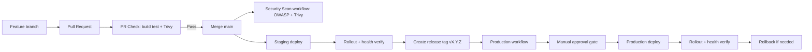

# CI/CD-putken tuotantokelpoistaminen (Spring Boot + Docker + Rahti/OpenShift)

## 1 Johdanto

Tässä seminaarityössä kehitetään CI/CD-putki Ohjelmistoprojekti 2 -kurssin projektityölle.

Projektissa tiimi kehittää projektinhallintatyökalua nimeltä Prokress, joka hyödyntää Kanban-taulua tehtävien hallintaan. Sovellus mahdollistaa tehtävien luomisen, muokkaamisen, poistamisen sekä siirtämisen sarakkeiden välillä drag-and-drop-toiminnallisuudella.

Käyttäjät voivat luoda omia sekä jaettuja projekteja, määrittää tehtäville vastuuhenkilön ja kommentoida tehtäviä.

Työn fokus on backend-julkaisuketjussa (Spring Boot + Docker + OpenShift), koska se sisältää eniten operatiivista riskiä: build-epäonnistumiset, riippuvuushaavoittuvuudet, rollout-ongelmat ja tuotantokatkokset.

### 1.1 Rajaus ja tutkimuskysymykset

Työ rajataan seuraaviin kysymyksiin:

1. Miten estetään rikkinäisen tai haavoittuvan muutoksen pääsy tuotantoon?
2. Miten varmistetaan, että julkaisu on toistettava eri ympäristöissä?
3. Miten palautuminen tehdään nopeasti, jos julkaisu epäonnistuu?
4. Miten putken suorituskyky pidetään järkevänä ilman, että turvallisuus heikkenee?

## 2 Tavoitteet 

Projektin tavoitteena on automatisoida build-, testaus-, turvallisuus- ja deploy-prosessit sekä parantaa julkaisuvarmuutta ja palautumiskykyä.

Putkessa hyödynnetään staging- ja production-ympäristöjä OpenShiftissä. Production-ympäristössä käyttöönotto edellyttää hyväksyntäporttia (approval gate), ja julkaisun yhteydessä varmistetaan onnistunut rollout sekä sovelluksen toimivuus. Tarvittaessa järjestelmä tukee myös nopeaa rollbackia aiempaan versioon.

Hyväksymiskriteerit tälle työlle:

- PR ei mene läpi, jos build/test failaa.
- PR ei mene läpi, jos Trivy löytää HIGH/CRITICAL löydöksen.
- Staging-deploy vahvistetaan rollout- ja health-checkillä.
- Production-deploy vaatii GitHub Environment -hyväksynnän.
- Rollback voidaan suorittaa yhdellä komennolla ja sen onnistuminen voidaan todentaa.

## 3. Toteutusymparistö ja teknologiat

- Sovellus: Spring Boot (Java 21), Maven, PostgreSQL
- CI/CD: GitHub Actions
- Kontitus: Docker, GHCR
- Deploy: OpenShift / Rahti
- Security gate: OWASP Dependency-Check + Trivy
- Operointi: rollout verify + rollback shell-skriptit

## 4. Ratkaisun arkkitehtuuri



### 4.1 Triggeri- ja vastuumatriisi

| Workflow | Triggeri | Päätarkoitus | Lopputulos |
|---|---|---|---|
| `pr-check.yml` | Pull Request -> `main` | Laatu- ja tietoturvaportti PR:lle | Merge estyy virhetilanteessa |
| `security-scan.yml` | `workflow_dispatch` + cron | Syvempi riippuvuus- ja image-skannaus | Raportti artifactina |
| `deploy-staging.yml` | Push -> `main` + manuaalinen | Staging-julkaisu ja validointi | Toimiva staging-versio |
| `deploy-production.yml` | Tag `v*.*.*` + manuaalinen | Hallittu tuotantojulkaisu approval gatella | Tuotantoversio tai estetty julkaisu |

## 5. CI/CD-putken koodi


Kuva: CI/CD-putken koodirakenne Prokressin backendissä.

### 5.1 PR-laatu- ja tietoturvaportti

Tiedosto: pr-check.yml

Toteutetut vaiheet:
- Maven build ja testit (`mvn clean verify`)
- Docker image build
- Trivy image scan (HIGH/CRITICAL -> fail)

PR-portti varmistaa, että mergeen menevä muutos on teknisesti toimiva ja ettei konttikuvassa ole kriittisiä haavoittuvuuksia.

Keskeinen toteutusidea:

```yaml
on:
  pull_request:
    branches: [main]

jobs:
  quality:
    steps:
      - run: mvn -B -f project-management-app/pom.xml clean verify
      - run: docker build -t project-management-app:pr-${{ github.sha }} .
      - uses: aquasecurity/trivy-action@master
```

Esimerkki:

Pull request hylätään automaattisesti jos:
- build epäonnistuu
- testit failaavat
- Trivy löytää HIGH tai CRITICAL haavoittuvuuden

Tämä estää rikkinäisen tai haavoittuvan koodin päätymisen main-haaraan.

PR scan -ajon onnistuminen käytännössä:


Kuva: GitHub Actions -ajo, jossa Build and Test -jobi meni läpi ja Trivy-skannaus suoritettiin onnistuneesti.

### 5.2 Erillinen security-scan workflow

Tiedosto: security-scan.yml

Toteutetut vaiheet:
- OWASP Dependency-Check Maven-pluginilla (CVSS-raja)
- Trivy container scan
- Dependency-Check-raportin julkaisu artifactina

Security scan kattaa kaksi tasoa:
- Dependency taso (OWASP): tunnetut haavoittuvuudet kirjastoissa
- Container taso (Trivy): OS + runtime + packaged dependencies

Näin varmistetaan sekä sovelluksen että ajoympäristön turvallisuus.

Triggerit:
- manual workflow_dispatch
- ajastettu ajo (cron)

Perustelu:
OWASP-skannaus oli raskas ja hidasti PR-putkea merkittävästi, joten se siirrettiin erilliseen workflowhun. Tämä tekee putkesta nopeamman ja skannauksesta vakaamman.

Keskeinen toteutusidea:

```yaml
on:
  workflow_dispatch:
  schedule:
    - cron: "0 2 * * 1"

steps:
  - run: mvn -B -f project-management-app/pom.xml org.owasp:dependency-check-maven:check -DfailBuildOnCVSS=7
  - run: docker build -t project-management-app:security-${{ github.sha }} .
  - uses: aquasecurity/trivy-action@master
```

Käytännössä tämä jakaa kuorman kahteen kerrokseen:

- PR-vaihe: nopea, estää selvät regressiot ja kriittiset image-riskit.
- Ajastettu/manuaalinen vaihe: syvempi dependency-analyysi raportointia varten.


Kuva: GitHub Actions -ajo, jossa Prokress ei läpäissyt OWASP Dependency-Checkiä.

### 5.3 Staging deploy

Tiedosto: deploy-staging.yml

Sisältö:
- image build + push GHCR:aan
- deploy OpenShiftiin
- rolloutin ja healthin varmistus skriptillä

Keskeinen toteutusidea:

```yaml
on:
  push:
    branches: [main]

jobs:
  build-and-push:
    outputs:
      image_ref: ${{ steps.image.outputs.image_ref }}
  deploy-staging:
    needs: build-and-push
```

Staging toimii "viimeisenä testiasemana" ennen tuotantoa: julkaisu tehdään oikeaan klusteriin ja toimivuus tarkistetaan automaattisesti ennen kuin muutosta pidetään valmiina.

Build and Push Image -vaiheen onnistunut ajo:


Kuva: GitHub Actionsin `Build and Push Image` -jobi, jossa konttikuva rakennetaan ja pusketaan GHCR:ään.

Deploy to Staging -vaiheen onnistunut ajo:


Kuva: GitHub Actionsin `Deploy to Staging` -jobi, jossa image deployataan OpenShiftiin ja rollout verifioidaan.

### 5.4 Production deploy + approval gate

Tiedosto: deploy-production.yml

Sisältö:
- trigger tagista (`v*.*.*`) tai manuaalisesti
- deploy production namespaceen
- GitHub environment `production` ja required reviewers

Keskeinen toteutusidea:

```yaml
on:
  push:
    tags: ["v*.*.*"]
  workflow_dispatch:

jobs:
  deploy-production:
    environment:
      name: production
```

Approval gate pienentää inhimillisen virheen riskiä: tuotantoon ei voi julkaista vahingossa pelkällä pushilla, vaan julkaisu vaatii erillisen hyväksynnän.

### 5.5 OpenShift-manifestit ja operointiskriptit

- ops/openshift/deployment.yaml
- ops/openshift/service.yaml
- ops/openshift/route.yaml
- ops/openshift/deploy.sh
- ops/openshift/verify-rollout.sh
- ops/openshift/rollback.sh

Rollback suoritetaan komennolla:

./ops/openshift/rollback.sh prokress-backend project-management-app

Tämä palauttaa viimeisimmän toimivan version OpenShiftissa.


Kuva: Rollback scriptin toimivuus testattu Git Bashilla.


Skriptien vastuut:

- `deploy.sh`: valitsee projektin, applyaa manifestit, asettaa imagetagin ja käynnistää rolloutin.
- `verify-rollout.sh`: odottaa rolloutin valmistumisen ja tekee tarvittaessa ulkoisen health-checkin (`/actuator/health`).
- `rollback.sh`: palauttaa edellisen revision ja odottaa rollbackin valmistumisen.

### 5.6 Sovelluksen Health Check -valmius Openshiftiä varten

Sovellukseen lisättiin:

- Actuator health/info -endpointit
- sallinnat health-endpointeille security-konfiguraatiossa

Tämä oli kriittinen osa putkea, koska deploy ilman todellista health-varmistusta ei takaa, että sovellus on oikeasti käyttökelpoinen.

### 5.7 Salaisuuksien ja asetusten hallinta

Putki hyödyntää GitHub Secrets -muuttujia, joita ei kovakoodata workflowihin:

- `OPENSHIFT_SERVER`
- `OPENSHIFT_TOKEN`
- `OPENSHIFT_NAMESPACE_STAGING`
- `OPENSHIFT_NAMESPACE_PRODUCTION`
- `OPENSHIFT_ROUTE_HOST_STAGING`
- `OPENSHIFT_ROUTE_HOST_PRODUCTION`
- `NVD_API_KEY`

Tällä vältetään arkaluontoisen tiedon päätyminen repositorioon ja mahdollistetaan ympäristökohtainen konfigurointi ilman koodimuutoksia.


Kuva: Lisätyt enviroment- sekä repository secretit. 

### 5.8 Toteutunut staging-häiriö ja korjaavat muutokset

Projektissa tuli vastaan ketjuvirhe staging-julkaisussa. Alkuvaiheessa oireena oli rolloutin jumittuminen viestiin "old replicas are pending termination", mutta juurisyy paljastui vasta podien eventeista.

Havaitut virheet:

- `ImagePullBackOff`
- `ErrImagePull`
- `FailedToRetrieveImagePullSecret`
- `CreateContainerConfigError`

Juurisyyt:

1. GHCR-imagen haku epäonnistui (`invalid username/password: unauthorized`), koska image pull -secretin tunnukset eivät olleet kunnossa.
2. Uudessa podissa ilmeni `CreateContainerConfigError`, koska sovellus odotti salaisuutta `project-management-app-secrets`, jota ei ollut olemassa target-namespacessa.

Korjaus:

1. Deploymentiin lisättiin `imagePullSecrets`-määrittely (`ghcr-pull-secret`).
2. Namespaceen luotiin toimiva `ghcr-pull-secret` (registry `ghcr.io`, GitHub-käyttäjä, PAT jossa `read:packages`).
3. Namespaceen luotiin puuttuva `project-management-app-secrets`, jossa avaimet:
  - `POSTGRESQL_DATABASE`
  - `POSTGRESQL_USER`
  - `POSTGRESQL_PASSWORD`
4. Staging- ja production-workflowihin lisättiin concurrency-lukitus estämään päällekkäiset deploy-ajot samaan ympäristöön.

## 6. Tuotantoputken hallinta ja julkaisumalli

Käyttöön otettiin seuraavat hallintakäytannot:
- branch protection `main`-branchille
- merge vain PR:n kautta
- pakollinen onnistunut status check ennen mergeä
- vaaditut reviewerit production-julkaisuun
- release tag -malli (`vMAJOR.MINOR.PATCH`)

Tällä mallilla julkaisu on hallittu ja toistettava prosessi.

## 7. Ennen vs jälkeen

| Mittari | Ennen | Jälkeen |
|---|---|---|
| PR-laadunvarmistus | Ei yhtenäistä gatea | Build + test + Trivy automaattisesti |
| Riippuvuusturvallisuus | Manuaalinen tai satunnainen | OWASP Security Scan erillisessä workflowissa |
| Staging-julkaisu | Pääosin manuaalinen | Automatisoitu workflow |
| Production-julkaisu | Ei virallista approval gatea | GitHub environment approval gate |
| Rollback | Ei vakioitua prosessia | Scriptattu rollback |
| Julkaisun toistettavuus | Vaihteleva | Dokumentoitu ja toistettava |

Huomio:
- OWASP Security Scan voi olla ensimmäisellä ajolla hidas NVD-datan päivityksen takia.
- `NVD_API_KEY` nopeuttaa skannauksia merkittävästi.

## 8. Ongelmia ja niiden ratkaisut

| Ongelma | Juuri-syy | Ratkaisu |
|---|---|---|
| PR-putki hidastui liikaa | OWASP-skannaus liian raskas jokaisessa PR-ajossa | OWASP siirrettiin erilliseen `security-scan.yml` workflowhin |
| Skannauksen kesto vaihteli paljon | NVD-datan päivitys ilman API-avainta | `NVD_API_KEY` käyttöön + välimuisti dependency-check datalle |
| Julkaisun onnistuminen jäi epäselväksi | Deploy tehtiin, mutta runtime-terveyttä ei varmistettu | `verify-rollout.sh` + `/actuator/health` tarkistus |
| Tuotantojulkaisun riski liian korkea | Ei erillistä hyväksyntäporttia | GitHub Environment `production` + required reviewers |
| Rollout jumittui (`old replicas are pending termination`) | Päällekkäiset deploy-ajot samaan namespaceen | Workflow concurrency + vain yksi aktiivinen deploy per ympäristö |
| Podi ei saanut imagea GHCR:stä (`ImagePullBackOff`) | Väärä/puutteellinen image pull -autentikointi | `ghcr-pull-secret` luotiin uudelleen toimivalla PAT:lla |
| Podi jäi tilaan `CreateContainerConfigError` | Puuttuva sovellussalaisuus `project-management-app-secrets` | Salaisuus luotiin ja siihen lisättiin PostgreSQL-avaimet |

Keskeinen oppi: tuotantokelpoinen putki ei ole vain "automaattinen deploy", vaan kontrollien ketju, jossa jokainen vaihe tuottaa todisteen julkaistavuudesta.

## 9 Käytännön häiriötilanne-esimerkki

Seuraava skenaario kuvaa realistisen tilanteen:

1. Uusi release-tag (`v1.4.0`) käynnistää production-workflown.
2. Deploy onnistuu teknisesti, mutta health-check epäonnistuu (esim. väärä konfiguraatio).
3. `verify-rollout.sh` palauttaa virheen, jolloin workflow epäonnistuu näkyvästi.
4. Tiimi ajaa rollbackin komennolla `./rollback.sh <namespace> <app>`.
5. Rollbackin jälkeen `oc rollout status` vahvistaa palautumisen.

Tämä malli minimoi käyttökatkon keston ja tekee palautumisesta standardoidun, harjoiteltavan toimenpiteen.

## 10. Mitä opin

- tuotantokelpoinen CI/CD on ennen kaikkea riskienhallintaa
- security gate tulee suunnitella niin, etta se on vakaa ja toistettava
- deployment ei riitä ilman verifiointia 
- rollback kannattaa tuotteistaa etukäteen, ei vasta ongelmatilanteessa
- GitHub branch protection + environment approvals ovat olennainen osa teknistä laatua

## 11. Jatkokehitysideat

- smoke-testit stagingiin
- image signing (Cosign)
- SARIF-raportit
- mittarit (lead time, MTTR)
- dependency-checkin cache optimointi

## 12. Lähteet

- GitHub Actions documentation: https://docs.github.com/actions
- OWASP Dependency-Check: https://jeremylong.github.io/DependencyCheck/
- Trivy documentation: https://trivy.dev/latest/
- OpenShift docs: https://docs.openshift.com/
- Spring Boot Actuator: https://docs.spring.io/spring-boot/reference/actuator/

## 13. Video

- Placeholder
