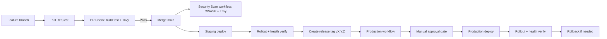
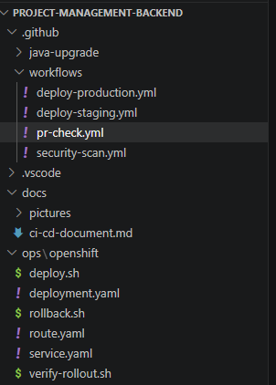
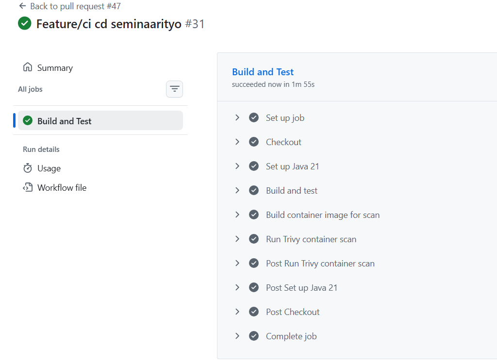
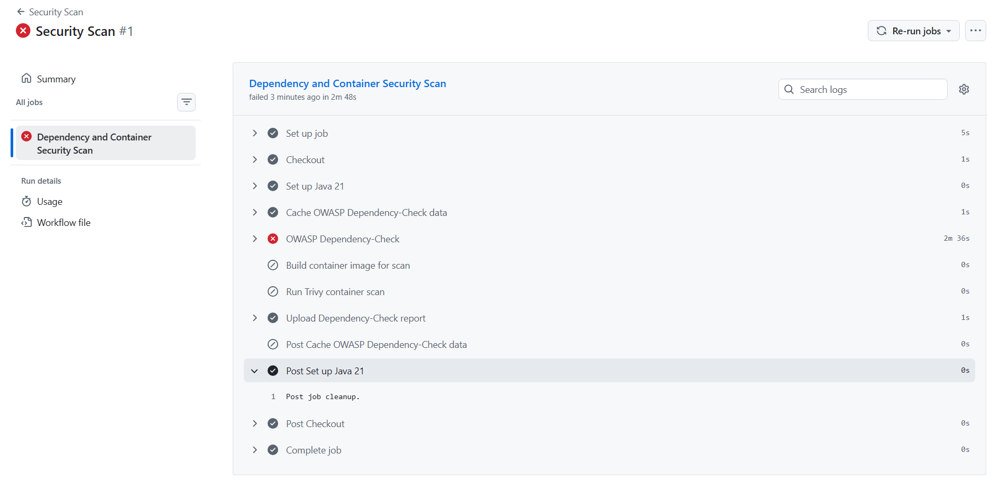
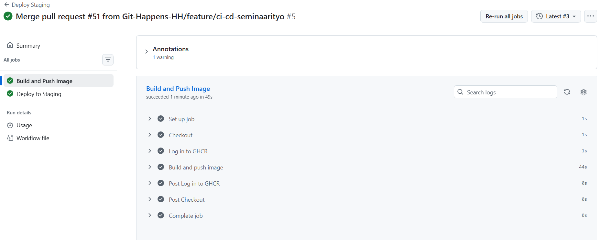
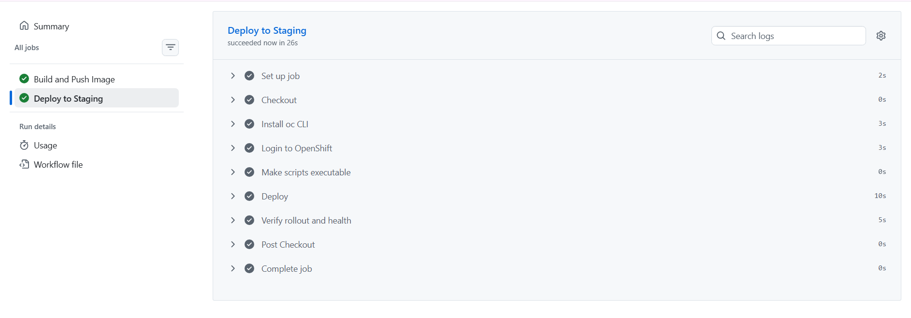
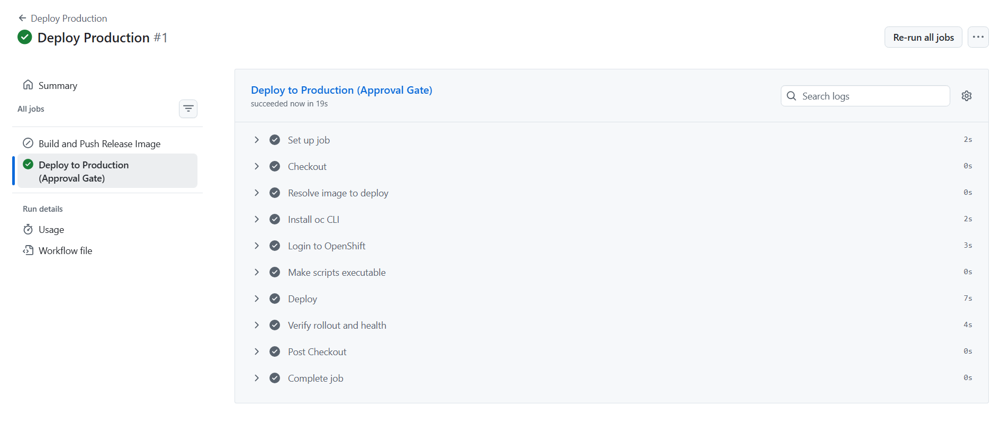
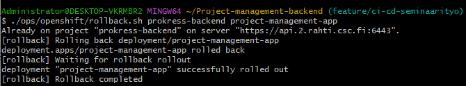
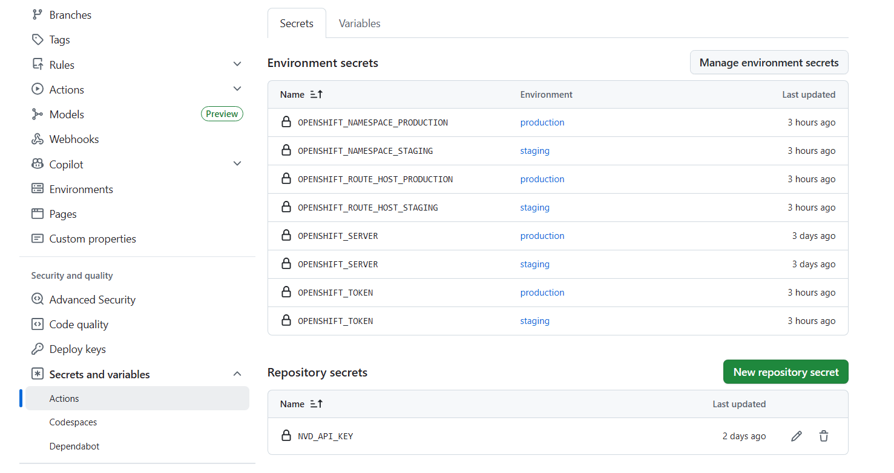

# CI/CD-putken tuotantokelpoistaminen (Spring Boot + Docker + Rahti/OpenShift)

## Sisällysluettelo

1. [Johdanto](#1-johdanto)  
   1.1 [Rajaus ja tutkimuskysymykset](#11-rajaus-ja-tutkimuskysymykset)  

2. [Tavoitteet](#2-tavoitteet)  

3. [Toteutusympäristö ja teknologiat](#3-toteutusymparisto-ja-teknologiat)  

4. [Ratkaisun arkkitehtuuri](#4-ratkaisun-arkkitehtuuri)  
   4.1 [Triggeri- ja vastuumatriisi](#41-triggeri--ja-vastuumatriisi)  

5. [CI/CD-putken koodi](#5-cicd-putken-koodi)  
   5.1 [PR-laatu- ja tietoturvaportti](#51-pr-laatu--ja-tietoturvaportti)  
   5.2 [Erillinen security-scan workflow](#52-erillinen-security-scan-workflow)  
   5.3 [Staging deploy](#53-staging-deploy)  
   5.4 [Production deploy + approval gate](#54-production-deploy--approval-gate)  
   5.5 [OpenShift-manifestit ja operointiskriptit](#55-openshift-manifestit-ja-operointiskriptit)  
   5.6 [Sovelluksen Health Check -valmius OpenShiftiä varten](#56-sovelluksen-health-check--valmius-openshiftiä-varten)  
   5.7 [Salaisuuksien ja asetusten hallinta](#57-salaisuuksien-ja-asetusten-hallinta)  
   5.8 [Toteutunut staging-häiriö ja korjaavat muutokset](#58-toteutunut-staging-hairio-ja-korjaavat-muutokset)  

6. [Tuotantoputken hallinta ja julkaisumalli](#6-tuotantoputken-hallinta-ja-julkaisumalli)  

7. [Ennen vs jälkeen](#7-ennen-vs-jalkeen)  
   7.1 [Julkaisuaika-mittaus: Ennen](#71-julkaisuaika-mittaus-ennen-manuaalinen-prosessi)  
   7.2 [Julkaisuaika-mittaus: Jälkeen](#72-julkaisuaika-mittaus-jalkeen-automatisoitu-prosessi)  

8. [Ongelmia ja niiden ratkaisut](#8-ongelmia-ja-niiden-ratkaisut)  

9. [Käytännön häiriötilanne-esimerkki](#9-kaytannon-hairiotilanne-esimerkki)  

10. [Testcontainers-integraatio CI/CD-putkeen](#10-testcontainers-integraatio-cicd-putkeen)  

11. [Mitä opin](#11-mita-opin)  

12. [Jatkokehitysideat](#12-jatkokehitysideat)  

13. [Yhteenveto](#13-yhteenveto)  

14. [Lähteet](#14-lahteet)  

15. [Video](#15-video)  

16. [Projektin lähdekoodi](#16-projektin-lahdekoodi)

## 1 Johdanto <a id="1-johdanto"></a>

Tässä seminaarityössä toteutan CI/CD-putken Ohjelmistoprojekti 2 -kurssin projektityölle.

Projektissa tiimimme kehittää projektinhallintatyökalua nimeltä Prokress, joka hyödyntää Kanban-taulua tehtävien hallintaan. Sovellus mahdollistaa tehtävien luomisen, muokkaamisen, poistamisen sekä siirtämisen sarakkeiden välillä drag-and-drop-toiminnallisuudella.

Käyttäjät voivat luoda omia sekä jaettuja projekteja.

Työssä keskitytään ainoastaan backend-julkaisuketjuun (Spring Boot + Docker + OpenShift), koska se sisältää eniten riskiä: build-epäonnistumiset, riippuvuushaavoittuvuudet ja rollout-ongelmat.

### 1.1 Rajaus ja tutkimuskysymykset <a id="11-rajaus-ja-tutkimuskysymykset"></a>

Työ rajataan seuraaviin kysymyksiin:

1. Miten estetään rikkinäisen tai haavoittuvan muutoksen pääsy tuotantoon?
2. Miten varmistetaan, että julkaisu on toistettava eri ympäristöissä?
3. Miten palautuminen tehdään nopeasti, jos julkaisu epäonnistuu?
4. Miten putken suorituskyky pidetään järkevänä ilman, että turvallisuus heikkenee?

## 2 Tavoitteet <a id="2-tavoitteet"></a>

Projektin tavoitteena on automatisoida build-, testaus-, turvallisuus- ja deploy-prosessit sekä parantaa julkaisuvarmuutta ja palautumiskykyä.

Putkessa hyödynnetään staging- ja production-ympäristöjä OpenShiftissä. Production-ympäristössä käyttöönotto edellyttää hyväksyntäporttia (approval gate), ja julkaisun yhteydessä varmistetaan onnistunut rollout sekä sovelluksen toimivuus. Tarvittaessa järjestelmä tukee myös nopeaa rollbackia aiempaan versioon.

Hyväksymiskriteerit tälle työlle:

- PR ei mene läpi, jos build/test failaa.
- PR ei mene läpi, jos Trivy löytää HIGH/CRITICAL löydöksen.
- Staging-deploy vahvistetaan rollout- ja health-checkillä.
- Production-deploy vaatii hyväksynnän multa tiimin jäseniltä.
- Rollback voidaan suorittaa yhdellä komennolla.

## 3 Toteutusympäristö ja teknologiat <a id="3-toteutusymparisto-ja-teknologiat"></a>

- Sovellus: Spring Boot (Java 21), Maven, PostgreSQL
- CI/CD: GitHub Actions
- Kontitus: Docker, GHCR
- Deploy: OpenShift / Rahti
- Security gate: OWASP Dependency-Check + Trivy
- Operointi: rollout verify + rollback shell-skriptit

## 4 Ratkaisun arkkitehtuuri <a id="4-ratkaisun-arkkitehtuuri"></a>



### 4.1 Triggeri- ja vastuumatriisi <a id="41-triggeri--ja-vastuumatriisi"></a>

| Workflow | Triggeri | Päätarkoitus | Lopputulos |
|---|---|---|---|
| `pr-check.yml` | Pull Request -> `main` | Laatu- ja tietoturvaportti PR:lle | Merge estyy virhetilanteessa |
| `security-scan.yml` | `workflow_dispatch` + cron | Syvempi riippuvuus- ja image-skannaus | Raportti artifactina |
| `deploy-staging.yml` | Push -> `main` + manuaalinen | Staging-julkaisu ja validointi | Toimiva staging-versio |
| `deploy-production.yml` | Tag `v*.*.*` + manuaalinen | Hallittu tuotantojulkaisu approval gatella | Tuotantoversio tai estetty julkaisu |

## 5 CI/CD-putken koodi <a id="5-cicd-putken-koodi"></a>



Kuva: CI/CD-putken koodirakenne Prokressin backendissä.

### 5.1 PR-laatu- ja tietoturvaportti <a id="51-pr-laatu--ja-tietoturvaportti"></a>

Tiedosto: [pr-check.yml](../.github/workflows/pr-check.yml)

Toteutetut vaiheet:
- Maven build ja testit (`mvn clean verify`)
- Docker image build
- Trivy image scan (HIGH/CRITICAL -> fail)

PR-portti varmistaa, että mergeen menevä muutos on teknisesti toimiva ja ettei konttikuvassa ole kriittisiä haavoittuvuuksia.

Keskeinen toteutusidea:

```yaml
on:
  pull_request:
    branches: [main]

jobs:
  quality:
    steps:
      - run: mvn -B -f project-management-app/pom.xml clean verify
      - run: docker build -t project-management-app:pr-${{ github.sha }} .
      - uses: aquasecurity/trivy-action@master
```

Esimerkki:

Pull request hylätään automaattisesti jos:
- build epäonnistuu
- testit failaavat
- Trivy löytää HIGH tai CRITICAL haavoittuvuuden

Tämä estää rikkinäisen tai haavoittuvan koodin päätymisen main-haaraan.

PR scan -ajon onnistuminen käytännössä:



Kuva: GitHub Actions -ajo, jossa Build and Test -jobi meni läpi ja Trivy-skannaus suoritettiin onnistuneesti.

### 5.2 Erillinen security-scan workflow <a id="52-erillinen-security-scan-workflow"></a>

Tiedosto: [security-scan.yml](../.github/workflows/security-scan.yml)

Toteutetut vaiheet:
- OWASP Dependency-Check Maven-pluginilla (CVSS-raja)
- Trivy container scan
- Dependency-Check-raportin julkaisu artifactina

Security scan kattaa kaksi tasoa:
- Dependency taso (OWASP): tunnetut haavoittuvuudet kirjastoissa
- Container taso (Trivy): OS + runtime + packaged dependencies

Näin varmistetaan sekä sovelluksen että ajoympäristön turvallisuus.

Triggerit:
- manual workflow_dispatch
- ajastettu ajo (cron)

Perustelu:
OWASP-skannaus oli raskas ja hidasti PR-putkea liikaa, joten siirsin sen erilliseen workflowiin. Tämä tekee putkesta nopeamman niin että Ohjelmistoprojekti 2 ei häiriinny liikaa.

Keskeinen toteutusidea:

```yaml
on:
  workflow_dispatch:
  schedule:
    - cron: "0 2 * * 1"

steps:
  - run: mvn -B -f project-management-app/pom.xml org.owasp:dependency-check-maven:check -DfailBuildOnCVSS=7
  - run: docker build -t project-management-app:security-${{ github.sha }} .
  - uses: aquasecurity/trivy-action@master
```

Käytännössä tämä jakaa kuorman kahteen kerrokseen:

- PR-vaihe: nopea, estää selvät regressiot ja kriittiset image-riskit.
- Ajastettu/manuaalinen vaihe: syvempi dependency-analyysi raportointia varten.



Kuva: GitHub Actions -ajo, jossa Prokress ei läpäissyt OWASP Dependency-Checkiä.

Tuloksen tulkinta: CI/CD-putki toimi oikein, koska security gate pysäytti julkaisun. Itse projekti ei kuitenkaan läpäissyt asetettuja turvakriteereitä, koska riippuvuuksista löytyi tunnettuja haavoittuvuuksia.

### 5.3 Staging deploy <a id="53-staging-deploy"></a>

Tiedosto: [deploy-staging.yml](../.github/workflows/deploy-staging.yml)

Sisältö:
- image build + push GHCR:aan
- deploy OpenShiftiin
- rolloutin ja healthin varmistus skriptillä

Keskeinen toteutusidea:

```yaml
on:
  push:
    branches: [main]

jobs:
  build-and-push:
    outputs:
      image_ref: ${{ steps.image.outputs.image_ref }}
  deploy-staging:
    needs: build-and-push
```

Staging toimii "viimeisenä testiasemana" ennen tuotantoa: julkaisu tehdään oikeaan klusteriin ja toimivuus tarkistetaan automaattisesti ennen kuin muutosta pidetään valmiina.

Build and Push Image -vaiheen onnistunut ajo:



Kuva: GitHub Actionsin `Build and Push Image` -jobi, jossa konttikuva rakennetaan ja pusketaan GHCR:ään.

Deploy to Staging -vaiheen onnistunut ajo:



Kuva: GitHub Actionsin `Deploy to Staging` -jobi, jossa image deployataan OpenShiftiin ja rollout verifioidaan.

### 5.4 Production deploy + approval gate <a id="54-production-deploy--approval-gate"></a>

Tiedosto: [deploy-production.yml](../.github/workflows/deploy-production.yml)

Sisältö:
- trigger tagista (`v*.*.*`) tai manuaalisesti
- deploy production namespaceen
- GitHub environment `production` ja required reviewers

Keskeinen toteutusidea:

```yaml
on:
  push:
    tags: ["v*.*.*"]
  workflow_dispatch:

jobs:
  deploy-production:
    environment:
      name: production
```

Approval gate pienentää inhimillisen virheen riskiä: tuotantoon ei voi julkaista vahingossa pelkällä pushilla, vaan julkaisu vaatii erillisen hyväksynnän.

Production deploy -vaiheen onnistunut ajo:



Kuva: GitHub Actionsin `Deploy to Production (Approval Gate)` -jobi onnistui, mukaan lukien rolloutin ja health-checkin verifiointi.

Tuloksen tulkinta: production-putki testattiin onnistuneesti end-to-end, joten julkaisuprosessi (manual approval gate + deploy + verify) on toimiva. Tässä projektissa staging ja production käyttävät kuitenkin käytännössä samaa OpenShift-ympäristöä, joten testi validoi ensisijaisesti prosessin luotettavuuden eikä erillisen tuotantoinfrastruktuurin eristystä.

### 5.5 OpenShift-manifestit ja operointiskriptit <a id="55-openshift-manifestit-ja-operointiskriptit"></a>

- [ops/openshift/deployment.yaml](../ops/openshift/deployment.yaml)
- [ops/openshift/service.yaml](../ops/openshift/service.yaml)
- [ops/openshift/route.yaml](../ops/openshift/route.yaml)
- [ops/openshift/deploy.sh](../ops/openshift/deploy.sh)
- [ops/openshift/verify-rollout.sh](../ops/openshift/verify-rollout.sh)
- [ops/openshift/rollback.sh](../ops/openshift/rollback.sh)

Rollback suoritetaan komennolla:

./ops/openshift/rollback.sh prokress-backend project-management-app

Tämä palauttaa viimeisimmän toimivan version OpenShiftissa.



Kuva: Rollback scriptin toimivuus testattu Git Bashilla.


Skriptien vastuut:

- `deploy.sh`: valitsee projektin, applyaa manifestit, asettaa imagetagin ja käynnistää rolloutin.
- `verify-rollout.sh`: odottaa rolloutin valmistumisen ja tekee tarvittaessa ulkoisen health-checkin (`/actuator/health`).
- `rollback.sh`: palauttaa edellisen revision ja odottaa rollbackin valmistumisen.

### 5.6 Sovelluksen Health Check -valmius OpenShiftiä varten <a id="56-sovelluksen-health-check--valmius-openshiftiä-varten"></a>

Sovellukseen lisättiin:

- Actuator health/info -endpointit
- sallinnat health-endpointeille security-konfiguraatiossa

Tämä oli kriittinen osa putkea, koska deploy ilman todellista health-varmistusta ei takaa, että sovellus on oikeasti käyttökelpoinen.

### 5.7 Salaisuuksien ja asetusten hallinta <a id="57-salaisuuksien-ja-asetusten-hallinta"></a>

Putki hyödyntää GitHub Secrets -muuttujia, joita ei kovakoodata workflowihin:

- `OPENSHIFT_SERVER`
- `OPENSHIFT_TOKEN`
- `OPENSHIFT_NAMESPACE_STAGING`
- `OPENSHIFT_NAMESPACE_PRODUCTION`
- `OPENSHIFT_ROUTE_HOST_STAGING`
- `OPENSHIFT_ROUTE_HOST_PRODUCTION`
- `NVD_API_KEY`

Tällä vältetään arkaluontoisen tiedon päätyminen repositorioon ja mahdollistetaan ympäristökohtainen konfigurointi ilman koodimuutoksia.



Kuva: Lisätyt environment- sekä repository secretit. 

### 5.8 Toteutunut staging-häiriö ja korjaavat muutokset <a id="58-toteutunut-staging-hairio-ja-korjaavat-muutokset"></a>

Projektissa tuli vastaan ketjuvirhe staging-julkaisussa. Alkuvaiheessa oireena oli rolloutin jumittuminen viestiin "old replicas are pending termination", mutta juurisyy paljastui vasta podien eventeistä.

Havaitut virheet:

- `ImagePullBackOff`
- `ErrImagePull`
- `FailedToRetrieveImagePullSecret`
- `CreateContainerConfigError`

Juurisyyt:

1. GHCR-imagen haku epäonnistui (`invalid username/password: unauthorized`), koska image pull -secretin tunnukset eivät olleet kunnossa.
2. Uudessa podissa ilmeni `CreateContainerConfigError`, koska sovellus odotti salaisuutta `project-management-app-secrets`, jota ei ollut olemassa target-namespacessa.

Korjaus:

1. Deploymentiin lisättiin `imagePullSecrets`-määrittely (`ghcr-pull-secret`).
2. Namespaceen luotiin toimiva `ghcr-pull-secret` (registry `ghcr.io`, GitHub-käyttäjä, PAT jossa `read:packages`).
3. Namespaceen luotiin puuttuva `project-management-app-secrets`, jossa avaimet:
  - `POSTGRESQL_DATABASE`
  - `POSTGRESQL_USER`
  - `POSTGRESQL_PASSWORD`
4. Staging- ja production-workflowihin lisättiin concurrency-lukitus estämään päällekkäiset deploy-ajot samaan ympäristöön.

## 6 Tuotantoputken hallinta ja julkaisumalli <a id="6-tuotantoputken-hallinta-ja-julkaisumalli"></a>

Käyttöön otettiin seuraavat hallintakäytännöt:
- branch protection `main`-branchille
- merge vain PR:n kautta
- pakollinen onnistunut status check ennen mergeä
- vaaditut reviewerit production-julkaisuun
- release tag -malli (`vMAJOR.MINOR.PATCH`)

Tällä mallilla julkaisu on hallittu ja toistettava prosessi.


## 7 Ennen vs jälkeen <a id="7-ennen-vs-jalkeen"></a>

| Mittari | Ennen | Jälkeen |
|---|---|---|
| PR-laadunvarmistus | Ei yhtenäistä gatea | Build + test + Trivy automaattisesti |
| Riippuvuusturvallisuus | Manuaalinen tai satunnainen | OWASP Security Scan erillisessä workflowissa |
| Staging-julkaisu | Pääosin manuaalinen | Automatisoitu workflow |
| Production-julkaisu | Ei virallista approval gatea | GitHub environment approval gate |
| Rollback | Ei vakioitua prosessia | Scriptattu rollback |
| Julkaisun toistettavuus | Vaihteleva | Dokumentoitu ja toistettava |

### 7.1 Julkaisuaika-mittaus: Ennen <a id="71-julkaisuaika-mittaus-ennen-manuaalinen-prosessi"></a>

Alla olevat ajat ovat arvioita:

| Vaihe | Aika | Kuvaus |
|---|---|---|
| 1. Paikallinen build + testit | 3-4 min | `mvn clean verify` omalla kehittäjäkoneella |
| 2. Docker image build | 4-5 min | `docker build` paikallisesti |
| 3. Image push GHCR:ään | 2-3 min | `docker push` verkkoyhteydestä riippuen |
| 4. Rahtiin kirjautuminen ja projektin päivittäminen | 5-6 min | Kirjaudutaan Rahti/OpenShift web UI:hin|
| 5. Turvallisuusskannaus (OWASP/Trivy) | 5–7 min | Ajetaan OWASP Dependency-Check ja/tai Trivy omalla koneella: esim. `mvn org.owasp:dependency-check-maven:check` ja `trivy image <image>`; tarkistetaan raportit ja varmistetaan ettei löydy kriittisiä haavoittuvuuksia. |
| 6. Staging manuaalinen testaus | 5-6 min | Selaimella UI:n testaaminen, endpoint-tarkistukset |
| 7. Production manual deploy | 3-4 min | Rollout ja uusi build ajetaan Rahti/OpenShift web UI:ssa |
| **Yhteensä** | **27–35 min** |  |

Jokainen manuaalinen vaihe sisältää myös virheriskin (väärä namespace, väärä image tag, copy-paste virhe jne).

### 7.2 Julkaisuaika-mittaus: Jälkeen <a id="72-julkaisuaika-mittaus-jalkeen-automatisoitu-prosessi"></a>

Nämä luvut on mitattu dokumentin kuvissa näkyvistä GitHub Actions -ajoista.

| Vaihe | Mitattu aika | Kuvaus |
|---|---|---|
| pr-check.yml (build + test + Trivy) | 1 min 10 s | PR Check -kuvassa näkyvä onnistunut ajo ([pr-scan-success.png](pictures/pr-scan-success.png)) |
| security-scan.yml (OWASP + Trivy) | 2 min 48 s | OWASP-scan.png-kuvassa näkyvä onnistunut ajo ([owasp-scan.png](pictures/owasp-scan.png)) |
| deploy-staging.yml (build + push + deploy + verify) | 1 min 15 s | Build and Push Image 49 s ([build_and_push_image.png](pictures/build_and_push_image.png)) + Deploy to Staging 26 s ([deploy_to_staging.png](pictures/deploy_to_staging.png)) |
| deploy-production.yml (deploy + verify) | 19 s | Deploy Production -kuvassa näkyvä onnistunut ajo ([production-deploy.png](pictures/production-deploy.png)) |
| **Yhteensä** | **noin 5 min 48 s** | |

Huomio:
- OWASP Security Scan voi olla ensimmäisellä ajolla hidas NVD-datan päivityksen takia.
- `NVD_API_KEY` nopeuttaa skannauksia merkittävästi.

## 8 Ongelmia ja niiden ratkaisut <a id="8-ongelmia-ja-niiden-ratkaisut"></a>

| Ongelma | Juurisyy | Ratkaisu |
|---|---|---|
| PR-putki hidastui liikaa | OWASP-skannaus liian raskas jokaisessa PR-ajossa | OWASP siirrettiin erilliseen `security-scan.yml` workflowhin |
| Skannauksen kesto vaihteli paljon | NVD-datan päivitys ilman API-avainta | `NVD_API_KEY` käyttöön + välimuisti dependency-check datalle |
| Julkaisun onnistuminen jäi epäselväksi | Deploy tehtiin, mutta runtime-terveyttä ei varmistettu | `verify-rollout.sh` + `/actuator/health` tarkistus |
| Tuotantojulkaisun riski liian korkea | Ei erillistä hyväksyntäporttia | GitHub Environment `production` + required reviewers |
| Rollout jumittui (`old replicas are pending termination`) | Päällekkäiset deploy-ajot samaan namespaceen | Workflow concurrency + vain yksi aktiivinen deploy per ympäristö |
| Podi ei saanut imagea GHCR:stä (`ImagePullBackOff`) | Väärä/puutteellinen image pull -autentikointi | `ghcr-pull-secret` luotiin uudelleen toimivalla PAT:lla |
| Podi jäi tilaan `CreateContainerConfigError` | Puuttuva sovellussalaisuus `project-management-app-secrets` | Salaisuus luotiin ja siihen lisättiin PostgreSQL-avaimet |

Keskeinen oppi: tuotantokelpoinen putki ei ole vain "automaattinen deploy", vaan kontrollien ketju, jossa jokainen vaihe tuottaa todisteen julkaistavuudesta.

## 9 Käytännön häiriötilanne-esimerkki <a id="9-kaytannon-hairiotilanne-esimerkki"></a>

Seuraava skenaario kuvaa realistisen tilanteen:

1. Uusi release-tag (`v1.4.0`) käynnistää production-workflown.
2. Deploy onnistuu teknisesti, mutta health-check epäonnistuu (esim. väärä konfiguraatio).
3. `verify-rollout.sh` palauttaa virheen, jolloin workflow epäonnistuu näkyvästi.
4. Tiimi ajaa rollbackin komennolla `./rollback.sh <namespace> <app>`.
5. Rollbackin jälkeen `oc rollout status` vahvistaa palautumisen.

Tämä malli minimoi käyttökatkon keston ja tekee palautumisesta standardoidun, harjoiteltavan toimenpiteen.

## 10 Testcontainers-integraatio CI/CD-putkeen <a id="10-testcontainers-integraatio-cicd-putkeen"></a>

### Millä tavalla Testcontainers liittyy tähän projektiin

Tiimin toinen jäsen teki seminaarityönsä [Testcontainersista](https://github.com/Git-Happens-HH/Project-management-backend/blob/main/docs/testcontainers.md), ja me päätimme ottaa sen käyttöön myös meidän CI/CD-putkessa. Osoittautui että Testcontainers sopii loistavasti putkeen. 

### Miten testcontainers parantaa CI/CD-putkea?

Normaalisti CI-pipelinessä pitäisi joko:
- Käyttää kevyitä mock-ratkaisuja testeissä (H2), jotka eivät vastaa oikeaa tuotantoa
- Tai ylläpitää erillistä docker-compose -setup:ia, joka on aina poissa synkasta koodin kanssa

Testcontainers ratkaisee tämän sitten niin, että testit itse käynnistävät Docker-konteissa oikean PostgreSQL-instanssin, kun `mvn clean verify` ajetaan, ja sammuttavat sen automaattisesti kun testit on tehty. Ei erillistä setup-scriptiä, ei manuaalista tietokanta-alustusta.

### Mitä hyötyä siitä käytännössä on

**1. Testit testaavat oikeasti tuotanto-yhteensopivuutta**
- H2-testit, vaikka toimivat, eivät koskaan takaa että sama koodi toimii PostgreSQL:n kanssa
- Nyt testit ajautuvat oikeaa tietokantaa vasten, ja jos jotain on vialla, nähdään se PR-vaiheessa eikä tuotannossa
- Ehkäisee häiriöitä

**2. Workflow-tiedostot pysyvät yksinkertaisina**
- Ei tarvitse ylläpitää erillisiä docker-compose -tiedostoja workflowissa
- Koko logiikka on sovelluskoodissa, mihin se kuuluukin
- Aika paljon parempi maintainability

**3. Kehittäjät voivat ajaa testit samalla tavalla lokaalisti**
- `mvn clean verify` toimii omalla koneella samalla tavalla kuin CI:ssä
- Kun jokin menee pieleen, saa debuggattua paikallisesti ilman CI-kontekstia

Ja tärkeintä: jos tietokanta-integraatio ei toimi, PR pysyy kiinni PR-vaiheessa. Ei päädy main-haaraan, ei pidemmälle putkeen.


### Miten se vaikutti meidän projektiimme

Käytännössä nyt meidän putki on selkeämpi: jokainen PR menee läpi build → test (Testcontainers) → security scan → merge. Testit varmistavat että koodi toimii oikean tietokannan kanssa, ennen kuin mitään deployataan. Yhdessä meidän approval-gaten kanssa se on melko solidi logiikka sille että staging-deployssa ei tule yllätyksiä.

## 11 Mitä opin <a id="11-mita-opin"></a>

- tuotantokelpoinen CI/CD on ennen kaikkea riskienhallintaa
- security gate tulee suunnitella niin, että se on vakaa ja toistettava
- deployment ei riitä ilman verifiointia 
- rollback kannattaa tuotteistaa etukäteen, ei vasta ongelmatilanteessa
- GitHub branch protection + environment approvals ovat olennainen osa teknistä laatua
- failaava security-scan voi olla onnistunut lopputulos, jos putki estää haavoittuvan buildin etenemisen
- CI/CD-putken toimivuus riippuu myös ympäristön salaisuuksista (image pull secret + sovelluksen env-secretit), ei pelkästään workflow-koodista
- oire ei aina ole juurisyy: rollout-jumi voi johtua taustalla image pull- tai secret-konfiguraatiosta
- kun staging ja production ovat samassa infrastruktuurissa, testaus validoi ennen kaikkea prosessin (gate + deploy + verify), ei ympäristöerottelua
- deploymentin ja podien eventien järjestelmällinen lukeminen nopeuttaa juurisyyn löytymistä merkittävästi

Tämän työn tärkein oppi oli se, että tuotantokelpoinen CI/CD-putki ei tarkoita pelkkää automaattista buildia ja deployta. Aluksi CI/CD näyttäytyi lähinnä sarjana teknisiä vaiheita: build, test, image build ja deploy. Työn aikana ymmärsin kuitenkin, että tuotantokelpoinen putki on ennen kaikkea riskienhallintajärjestelmä. Jokaisen vaiheen pitää joko estää huono muutos, todentaa julkaisun onnistuminen tai mahdollistaa nopea palautuminen virhetilanteessa.

Erityisesti opin erottamaan kolme eri tasoa: koodin laatu, julkaisun tekninen toistettavuus ja ajoympäristön toimivuus. Pelkkä `mvn clean verify` kertoo, että sovellus rakentuu ja testit menevät läpi. Docker image build kertoo, että sovellus voidaan paketoida ajettavaan muotoon. OpenShift-rollout ja `/actuator/health` taas kertovat, että sovellus käynnistyy oikeassa ympäristössä ja vastaa ulkoisesti. Nämä ovat eri asioita, ja siksi ne pitää todentaa erikseen.

Työssä jouduin tekemään myös kompromissejä. OWASP Dependency-Check olisi turvallisuuden näkökulmasta hyödyllinen jokaisessa PR-ajossa, mutta käytännössä se hidasti putkea ja teki siitä epävakaamman. Tämän takia siirsin OWASP-skannauksen erilliseen ajastettuun ja manuaalisesti käynnistettävään workflowiin, mutta jätin Trivyn PR-porttiin. Ratkaisu ei ole täydellinen, mutta se tasapainottaa nopeuden ja turvallisuuden: PR:t eivät hidastu liikaa, mutta riippuvuusturvallisuutta seurataan silti säännöllisesti.

Yksi tärkeimmistä käytännön opeista liittyi virheiden diagnosointiin OpenShiftissä. Rollout-virhe näytti ensin siltä, että vanhat replikat eivät poistu normaalisti. Todellinen juurisyy löytyi kuitenkin vasta podien eventeistä: ensin image pull -secret ei toiminut, ja sen jälkeen sovellukselta puuttui vaadittu runtime-secret. Tämä opetti, että CI/CD-ongelmia ei voi ratkaista katsomalla vain workflow-logia. Pitää osata lukea myös klusterin tilaa, deploymentteja, podeja ja eventtejä.

Jos tekisin työn uudelleen, erottaisin staging- ja production-ympäristöt selvemmin toisistaan jo alussa. Tässä työssä prosessi validoitiin onnistuneesti, mutta koska staging ja production olivat käytännössä samassa OpenShift-infrastruktuurissa, ympäristöerottelun testaaminen jäi rajalliseksi. Aidommassa tuotantoympäristössä käyttäisin erillisiä namespaceja, erillisiä routeja ja erillisiä secretejä.

Lisäksi lisäisin putkeen automaattiset smoke-testit staging-vaiheeseen. Nykyinen health-check kertoo, että sovellus on käynnissä, mutta se ei vielä todista, että tärkeimmät käyttötapaukset toimivat. Parempi seuraava vaihe olisi esimerkiksi kirjautumisen, projektin haun tai yksinkertaisen API-endpointin automaattinen testaus staging-deployn jälkeen.

Jatkossa osaan soveltaa tätä mallia myös muihin projekteihin. Perusperiaate on siirrettävissä: ensin PR-portti, sitten toistettava konttikuva, sen jälkeen staging-validointi, hyväksytty tuotantojulkaisu ja lopuksi rollback-mekanismi. Teknologiat voivat vaihtua, mutta sama ajattelutapa toimii.

## 12 Jatkokehitysideat <a id="12-jatkokehitysideat"></a>

- smoke-testit stagingiin
- image signing (Cosign)
- SARIF-raportit
- mittarit (lead time, MTTR)
- dependency-checkin cache-optimointi

## 13 Yhteenveto <a id="13-yhteenveto"></a>

Tässä työssä rakennettiin tuotantokelpoinen CI/CD-putki Spring Boot -sovellukselle, joka julkaistaan OpenShift/Rahti-ympäristöön. Automatisoitu putki kattaa buildin, testauksen, turvallisuusskannauksen, staging- ja tuotantodeployn sekä rollbackin.

Manuaaliseen prosessiin verrattuna julkaisu on nyt nopeampi, toistettavampi ja vähemmän virhealtis. Turvallisuutta parantavat PR-portit, erillinen security scan, hyväksyntäportti tuotantoon sekä automatisoidut health-checkit ja rollback. Testcontainers-integraatio mahdollistaa aidon tietokantatestaamisen jo PR-vaiheessa, mikä vähentää tuotantoyllätyksiä. Kokonaisuutena ratkaisu parantaa ohjelmiston laatua, julkaisuvarmuutta ja tiimin kehityskokemusta.

## 14 Lähteet <a id="14-lahteet"></a>

Docker 2024. Running Testcontainers tests using GitHub Actions. Luettavissa: https://www.docker.com/blog/running-testcontainers-tests-using-github-actions/
. Luettu: 26.4.2026.

GitHub 2026. GitHub Actions documentation. Luettavissa: https://docs.github.com/actions
. Luettu: 23.4.2026.

GitHub 2026. Managing your personal access tokens. Luettavissa: https://docs.github.com/authentication/keeping-your-account-and-data-secure/managing-your-personal-access-tokens
. Luettu: 25.4.2026.

GitHub 2026. Working with the Container registry. Luettavissa: https://docs.github.com/packages/working-with-a-github-packages-registry/working-with-the-container-registry
. Luettu: 24.4.2026.

Kubernetes 2026. Secrets. Luettavissa: https://kubernetes.io/docs/concepts/configuration/secret/
. Luettu: 24.4.2026.

OWASP Foundation 2026. Dependency-Check. Luettavissa: https://jeremylong.github.io/DependencyCheck/
. Luettu: 25.4.2026.

Red Hat 2026. OpenShift Documentation. Luettavissa: https://docs.openshift.com/
. Luettu: 23.4.2026.

Red Hat 2026. Using image pull secrets. Luettavissa: https://docs.openshift.com/container-platform/latest/openshift_images/managing_images/using-image-pull-secrets.html
. Luettu: 24.4.2026.

Red Hat 2026. Understanding deployments and DeploymentConfigs. Luettavissa: https://docs.openshift.com/container-platform/latest/applications/deployments/what-deployments-are.html
. Luettu: 25.4.2026.

Sonatype 2025. OSS Index authentication required. Luettavissa: https://ossindex.sonatype.org/doc/auth-required
. Luettu: 25.4.2026.

Spring 2026. Spring Boot Actuator. Luettavissa: https://docs.spring.io/spring-boot/reference/actuator/
. Luettu: 23.4.2026.

Trivy 2026. Trivy documentation. Luettavissa: https://trivy.dev/latest/
. Luettu: 25.4.2026.

## 15 Video <a id="15-video"></a>
  
https://haagahelia-my.sharepoint.com/:v:/r/personal/bhq676_myy_haaga-helia_fi/Documents/Videos/Clipchamp/Video%20Project/Exports/CICD-seminaarityo.mp4?csf=1&web=1&e=8ONDWx

## 16 Projektin lähdekoodi <a id="16-projektin-lahdekoodi"></a>

Seminaarityön toteutus löytyy GitHubista:

[Project Management Backend – CI/CD seminaarityö](https://github.com/Git-Happens-HH/Project-management-backend/tree/feature/ci-cd-seminaarityo)

Repositorio sisältää GitHub Actions -workflowt, Dockerfile- ja kontitusratkaisun sekä OpenShift-deploy-skriptit ja manifestit.