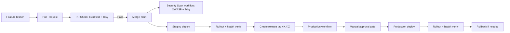

# CI/CD-putken tuotantokelpoistaminen (Spring Boot + Docker + Rahti/OpenShift)

## 1 Johdanto

Tässä seminaarityössä kehitetään CI/CD-putki Ohjelmistoprojekti 2 -kurssin projektityölle.

Projektissa tiimi kehittää projektinhallintatyökalua nimeltä Prokress, joka hyödyntää Kanban-taulua tehtävien hallintaan. Sovellus mahdollistaa tehtävien luomisen, muokkaamisen, poistamisen sekä siirtämisen sarakkeiden välillä drag-and-drop-toiminnallisuudella.

Käyttäjät voivat luoda omia sekä jaettuja projekteja, määrittää tehtäville vastuuhenkilön ja kommentoida tehtäviä.

## 2 Tavoitteet 

Projektin tavoitteena on automatisoida build-, testaus-, turvallisuus- ja deploy-prosessit sekä parantaa julkaisuvarmuutta ja palautumiskykyä.

Putkessa hyödynnetään staging- ja production-ympäristöjä OpenShiftissä. Production-ympäristössä käyttöönotto edellyttää hyväksyntäporttia (approval gate), ja julkaisun yhteydessä varmistetaan onnistunut rollout sekä sovelluksen toimivuus. Tarvittaessa järjestelmä tukee myös nopeaa rollbackia aiempaan versioon.

## 3. Toteutusymparistö ja teknologiat

- Sovellus: Spring Boot (Java 21), Maven, PostgreSQL
- CI/CD: GitHub Actions
- Kontitus: Docker, GHCR
- Deploy: OpenShift / Rahti
- Security gate: OWASP Dependency-Check + Trivy
- Operointi: rollout verify + rollback shell-skriptit

## 4. Ratkaisun arkkitehtuuri

## 5. CI/CD-putken koodi

### 5.1 PR-laatu- ja tietoturvaportti

Tiedosto: pr-check.yml

Toteutetut vaiheet:
- Maven build ja testit (`mvn clean verify`)
- Docker image build
- Trivy image scan (HIGH/CRITICAL -> fail)

PR-portti varmistaa, että mergeen menevä muutos on teknisesti toimiva ja ettei konttikuvassa ole kriittisiä haavoittuvuuksia.

Esimerkki:

Pull request hylätään automaattisesti jos:
- build epäonnistuu
- testit failaavat
- Trivy löytää HIGH tai CRITICAL haavoittuvuuden

Tämä estää rikkinäisen tai haavoittuvan koodin päätymisen main-haaraan.

### 5.2 Erillinen security-scan workflow

Tiedosto: security-scan.yml

Toteutetut vaiheet:
- OWASP Dependency-Check Maven-pluginilla (CVSS-raja)
- Trivy container scan
- Dependency-Check-raportin julkaisu artifactina

Security scan kattaa kaksi tasoa:
- Dependency taso (OWASP): tunnetut haavoittuvuudet kirjastoissa
- Container taso (Trivy): OS + runtime + packaged dependencies

Näin varmistetaan sekä sovelluksen että ajoympäristön turvallisuus.

Triggerit:
- manual workflow_dispatch
- ajastettu ajo (cron)

Perustelu:
OWASP-skannaus oli raskas ja hidasti PR-putkea merkittävästi, joten se siirrettiin erilliseen workflowhun. Tämä tekee putkesta nopeamman ja skannauksesta vakaamman.

### 5.3 Staging deploy

Tiedosto: deploy-staging.yml

Sisältö:
- image build + push GHCR:aan
- deploy OpenShiftiin
- rolloutin ja healthin varmistus skriptillä

### 5.4 Production deploy + approval gate

Tiedosto: deploy-production.yml

Sisältö:
- trigger tagista (`v*.*.*`) tai manuaalisesti
- deploy production namespaceen
- GitHub environment `production` ja required reviewers

### 5.5 OpenShift-manifestit ja operointiskriptit

- ops/openshift/deployment.yaml
- ops/openshift/service.yaml
- ops/openshift/route.yaml
- ops/openshift/deploy.sh
- ops/openshift/verify-rollout.sh
- ops/openshift/rollback.sh

Rollback suoritetaan komennolla:

./rollback.sh <namespace> <app>

Tämä palauttaa viimeisimmän toimivan version OpenShiftissa.

### 5.6 Sovelluksen Health Check -valmius Openshiftiä varten

SSovellukseen lisättiin:

- Actuator health/info -endpointit
- sallinnat health-endpointeille security-konfiguraatiossa

## 6. Tuotantoputken hallinta ja julkaisumalli

Käyttöön otettiin seuraavat hallintakäytannot:
- branch protection `main`-branchille
- merge vain PR:n kautta
- pakollinen onnistunut status check ennen mergeä
- vaaditut reviewerit production-julkaisuun
- release tag -malli (`vMAJOR.MINOR.PATCH`)

Tällä mallilla julkaisu on hallittu ja toistettava prosessi.

## 7. Ennen vs jälkeen

| Mittari | Ennen | Jälkeen |
|---|---|---|
| PR-laadunvarmistus | Ei yhtenäistä gatea | Build + test + Trivy automaattisesti |
| Riippuvuusturvallisuus | Manuaalinen tai satunnainen | OWASP Security Scan erillisessä workflowissa |
| Staging-julkaisu | Pääosin manuaalinen | Automatisoitu workflow |
| Production-julkaisu | Ei virallista approval gatea | GitHub environment approval gate |
| Rollback | Ei vakioitua prosessia | Scriptattu rollback |
| Julkaisun toistettavuus | Vaihteleva | Dokumentoitu ja toistettava |

Huomio:
- OWASP Security Scan voi olla ensimmäisellä ajolla hidas NVD-datan päivityksen takia.
- `NVD_API_KEY` nopeuttaa skannauksia merkittävästi.

## 8. Ongelmia ja niiden ratkaisut

Tyon aikana kohdattuja ongelmia:
- Versioiden yhteensopivuusongelmat
- Docker-pohjaisen OWASP-ajon pitkät jumit image pullissa ja datapäivityksissä
- pitkät skannausajat ilman NVD API keytä

Ratkaisuperiaate oli:
- CI/CD-putken yksinkertaistaminen
- Hauraiden riippuvuuksien poisto
- OWASP-scanin siirto erilliseen security-scan workflowin Maven-pluginiin
- Selkeät fail-kriteerit

## 9. Mitä opin

- tuotantokelpoinen CI/CD on ennen kaikkea riskienhallintaa
- security gate tulee suunnitella niin, etta se on vakaa ja toistettava
- deployment ei riitä ilman verifiointia 
- rollback kannattaa tuotteistaa etukäteen, ei vasta ongelmatilanteessa
- GitHub branch protection + environment approvals ovat olennainen osa teknistä laatua

## 10. Jatkokehitysideat

- smoke-testit stagingiin
- image signing (Cosign)
- SARIF-raportit
- mittarit (lead time, MTTR)
- dependency-checkin cache optimointi

## 11. Lähteet

- GitHub Actions documentation: https://docs.github.com/actions
- OWASP Dependency-Check: https://jeremylong.github.io/DependencyCheck/
- Trivy documentation: https://trivy.dev/latest/
- OpenShift docs: https://docs.openshift.com/
- Spring Boot Actuator: https://docs.spring.io/spring-boot/reference/actuator/

## 12. Video

- Placeholder
