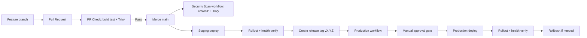

# CI/CD-putken tuotantokelpoistaminen (Spring Boot + Docker + Rahti/OpenShift)

## 1. Aihe ja tavoite

Tässä seminaarityössä laitan kasaan ohjelmistoprojekti 2:n Spring Boot sovelluksellemme tuotantokelpoisen CI/CD-putken.
Projektin tavoitteena on automatisoida build-, testaus-, turvallisuus- ja deploy-prosessit sekä parantaa julkaisuvarmuutta
ja palautumiskykyä.

Työssä on käytössä staging- ja production-deployt OpenShiftissä, productionissa approval gate sekä rolloutin varmistus ja rollback-toiminto.

## 2. Toteutusymparisto ja teknologiat

- Sovellus: Spring Boot (Java 21), Maven, PostgreSQL
- CI/CD: GitHub Actions
- Kontitus: Docker, GHCR
- Deploy: OpenShift / Rahti
- Security gate: OWASP Dependency-Check + Trivy
- Operointi: rollout verify + rollback shell-skriptit

## 3. Ratkaisun arkkitehtuuri

## 4. Mitä toteutettiin koodiin

### 4.1 PR-laatu- ja tietoturvaportti

Workflow: .github/workflows/pr-check.yml

Toteutetut vaiheet:
- Maven build ja testit (`mvn clean verify`)
- Docker image build
- Trivy image scan (HIGH/CRITICAL -> fail)

PR-portin tarkoitus on varmistaa, että mergeen menevä muutos on teknisesti ehjä ja ettei konttikuvassa ole kriittisia löytöjä.

Esimerkki:

Pull request hylätään automaattisesti jos:
- build epäonnistuu
- testit failaavat
- Trivy löytää HIGH tai CRITICAL haavoittuvuuden

Tämä estää rikkinäisen tai haavoittuvan koodin päätymisen main-branchiin.

### 4.2 Erillinen security-scan workflow

Workflow: .github/workflows/security-scan.yml

Toteutetut vaiheet:
- OWASP Dependency-Check Maven-pluginilla (CVSS-raja)
- Trivy container scan
- Dependency-Check-raportin julkaisu artifactina

Security scan kattaa kaksi tasoa:
- Dependency taso (OWASP): tunnetut haavoittuvuudet kirjastoissa
- Container taso (Trivy): OS + runtime + packaged dependencies

Näin varmistetaan sekä sovelluksen että ympäristön turvallisuus.

Triggerit:
- manual workflow_dispatch
- ajastettu ajo (cron)

Perustelu muutokselle:
- OWASP-skannaus oli raskas ja pidensi PR-putkea merkittävästi
- erillisessä workflowssa turvallisuustarkistus on vakaampi ja helpompi seurata

### 4.3 Staging deploy

Workflow: .github/workflows/deploy-staging.yml

Sisältö:
- image build + push GHCR:aan
- deploy OpenShiftiin
- rolloutin ja healthin varmistus skriptillä

### 4.4 Production deploy + approval gate

Workflow: .github/workflows/deploy-production.yml

Sisältö:
- trigger tagista (`v*.*.*`) tai manuaalisesti
- deploy production namespaceen
- GitHub environment `production` ja required reviewers

### 4.5 OpenShift-manifestit ja operointiskriptit

- ops/openshift/deployment.yaml
- ops/openshift/service.yaml
- ops/openshift/route.yaml
- ops/openshift/deploy.sh
- ops/openshift/verify-rollout.sh
- ops/openshift/rollback.sh

Rollback toteutetaan ajamalla:

./rollback.sh <namespace> <app>

Tämä palauttaa viimeisimmän toimivan version OpenShiftissa.

### 4.6 Sovelluksen valmius health-probeihin

Sovellukseen lisättiin tarvittavat muutokset:
- actuator health/info exposed profileen
- security-configiin sallinnat health-endpointeille

## 5. Governance ja julkaisumalli

Käyttöön otettiin seuraavat hallintakäytannot:
- branch protection `main`-branchille
- merge vain PR:n kautta
- pakollinen onnistunut status check ennen mergeä
- vaaditut reviewerit production-julkaisuun
- release tag -malli (`vMAJOR.MINOR.PATCH`)

Tälla mallilla julkaisu ei ole enää yksittäisen kehittäjän käsityota, vaan hallittu prosessi.

## 6. Ennen vs jalkeen

| Mittari | Ennen | Jälkeen |
|---|---|---|
| PR-laadunvarmistus | Ei yhtenäistä gatea | Build + test + Trivy automaattisesti |
| Riippuvuusturvallisuus | Manuaalinen tai satunnainen | OWASP Security Scan erillisessä workflowissa |
| Staging-julkaisu | Pääosin manuaalinen | Automatisoitu workflow |
| Production-julkaisu | Ei virallista approval gatea | GitHub environment approval gate |
| Rollback | Ei vakioitua prosessia | Scriptattu rollback |
| Julkaisun toistettavuus | Vaihteleva | Dokumentoitu ja toistettava |

Huomio:
- OWASP Security Scan voi olla ensimmäisellä ajolla hidas NVD-datan päivityksen takia.
- `NVD_API_KEY` nopeuttaa skannauksia merkittävästi.

## 7. Ongelmia ja niiden ratkaisut

Tyon aikana kohtasin useita CI/CD-ongelmia:
- Action-versioiden yhteensopivuusongelmat
- riippuvuus actioneista, jotka eivat toimineet odotetusti
- Docker-pohjaisen OWASP-ajon pitkät jumit image pullissa ja datapäivityksissä
- pitkät skannausajat ilman NVD API keytä

Ratkaisuperiaate oli:
- yksinkertaistettiin putkea
- poistettiin hauraat riippuvuudet
- siirrettiin OWASP-scan erilliseen security-scan workflowin Maven-pluginiin
- lisättiin selkeät fail-kriteerit

## 8. Mitä opin

Tärkeimmat oppimani asiat:
- tuotantokelpoinen CI/CD on ennen kaikkea riskienhallintaa
- security gate tulee suunnitella niin, etta se on vakaa ja toistettava
- deployment ei riitä ilman verifiointia (rollout + health)
- rollback kannattaa tuotteistaa etukäteen, ei vasta ongelmatilanteessa
- GitHub branch protection + environment approvals ovat olennainen osa teknistä laatua

## 9. Jatkokehitysideat

- lisää integroidut smoke-testit staging deployn jälkeen
- lisää image signing (esim. Cosign) ennen production deployta
- ota käyttöön SARIF-raportit security-löydöksille
- mittaa lead time ja MTTR automaattisesti (dashboard)
- erottele dependency-checkin data-cache pysyvämmin CI-ympäristöön

## 10. Oma osuus ja lähteet

### Oma osuus

Suunnittelin ja toteutin putken rakenteen, workflowit, OpenShift-manifestit, operointiskriptit sekä tarvittavat sovellusmuutokset. Lisäksi debuggasin käytännön CI-ajojen virheitä, kunnes putki vakautui.

### Lähteet

- GitHub Actions documentation: https://docs.github.com/actions
- OWASP Dependency-Check: https://jeremylong.github.io/DependencyCheck/
- Trivy documentation: https://trivy.dev/latest/
- OpenShift docs: https://docs.openshift.com/
- Spring Boot Actuator: https://docs.spring.io/spring-boot/reference/actuator/

## 11. Videolinkki

-----
