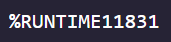
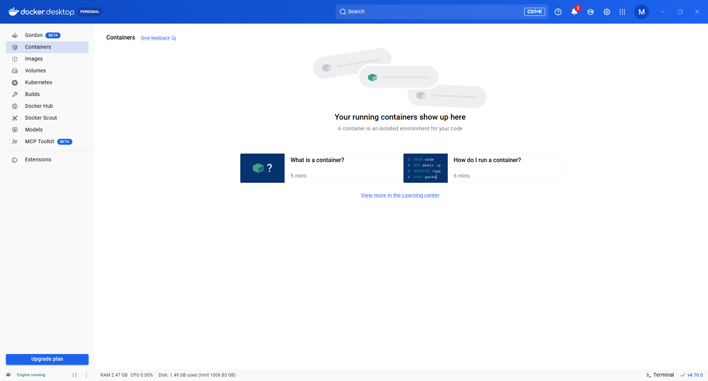
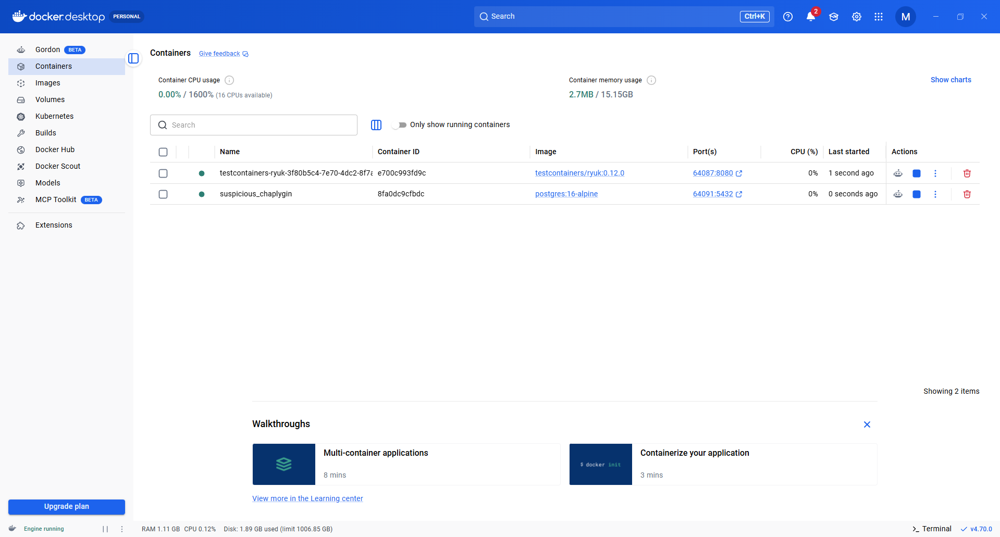
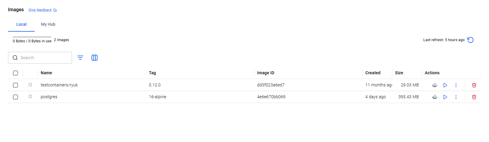
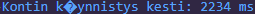

# Testcontainers Spring Boot -projektissa

## Sisällysluettelo

Huom. Otsikot eivät sisällä ääkkösiä, sillä muuten markdown-ankkurit (otsikoiden linkit) eivät toimi!

### 1. Johdanto
- [1.1 Aihealueen esittely](#11-aihealueen-esittely)  
- [1.2 Kohdeprojektin esittely](#12-kohdeprojektin-esittely)  
- [1.3 Taman seminaarityon tavoitteet](#13-taman-seminaarityon-tavoitteet)  

### 2. Testcontainers
- [2.1 Lyhyt esittely Testcontainers-kirjastosta](#21-lyhyt-esittely-testcontainers-kirjastosta)  
- [2.2 Docker-teknologian rooli](#22-docker-teknologian-rooli)  
- [2.3 Testin kaynnistys ja odotusstategia](#23-testin-kaynnistys-ja-odotusstategia)  
- [2.4 Testin loppuunajaminen ja resurssien siivous](#24-testin-loppuunajaminen-ja-resurssien-siivous)  

### 3. Projektin lahtotilanne
- [3.1 Nykyisten testien teknologiat](#31-nykyisten-testien-teknologiat)  
- [3.2 H2-testien esimerkkikoodit ja suoritusajat](#32-h2-testien-esimerkkikoodit-ja-suoritusajat)  

### 4. Testcontainersin toteutus
- [4.1 Esivalmistelut Testcontainersin kayttoonottoon](#41-esivalmistelut-testcontainersin-kayttoonottoon)  
- [4.2 Testcontainers testiluokan kirjoittaminen](#42-testcontainers-testiluokan-kirjoittaminen)  
- [4.3 Testcontainers testien ajaminen ja suoritusajat](#43-testcontainers-testien-ajaminen-ja-suoritusajat)  

### 5. H2 vs. Testcontainers + PostgreSQL
- [5.1 Tietokantojen vertailu keskenään](#51-tietokantojen-vertailu-keskenaan)
- [5.2 Sama testi, eri tietokanta, eri tulos](#52-sama-testi-eri-tietokanta-eri-tulos)

### 6. Haasteet ja opit
- [6.1 Keskeiset havainnot ja kokemukset](#61-keskeiset-havainnot-ja-kokemukset)

### 7. Jatkokehitys
- [7.1 Ideoita tulevaisuuteen](#71-ideoita-tulevaisuuteen)
- [7.2 BONUS: Testcontainersin yhdistäminen CI/CD-putkeen](#72-bonus-testcontainersin-yhdistaminen-cicd-putkeen)

### 8. Yhteenveto
- [8.1 Summa summarum](#81-summa-summarum)

### 9. Lahteet
- [9.1 Lahdeluettelo](#91-lahdeluettelo)

------

## 1. Johdanto

### 1.1 Aihealueen esittely 

Ohjelmistokehityksen tärkeimpiä kulmakiviä on ohjelmiston testaus. Testauksella arvioidaan ohjelmiston laatua ja havaitaan ohjelmiston eri osissa piileviä vikoja. 
Testauksessa on perinteisesti 3 testikerrosta:


                 /\
                /  \
               /    \
              /      \         
             /  E2E   \
            /----------\    
           /            \
          / INTEGRAATIO- \      
         /    TESTIT      \
        /----------------- \
       /                    \
      /     YKSIKKÖTESTIT    \  
     /________________________\


Yksikkötestit ovat jo tulleet melkoisen tutuiksi eri ohjelmointikursseilta. Tässä seminaarityössä haluan perehtyä enemmän keskimmäiseen tasoon, eli integraatiotestaukseen. Valitsin tässä työssä tutkittavaksi teknologiaksi Testcontainers-kirjaston, jolla voin testata sovelluksen ja tietokannan välistä integraatiota. Testcontainers mahdollistaa tuotantoympäristöä vastaavan tietokannan käytön testeissä,
mikä parantaa testien luotettavuutta ja realistisuutta verrattuna esimerkiksi H2-tietokantaan. (Testcontainers, s.a., Kurian 2025)


### 1.2 Kohdeprojektin esittely

Toteutan integraatiotestausta "Ohjelmistoprojekti II" -kurssin projektiimme [Prokress](https://github.com/orgs/Git-Happens-HH/repositories). Prokress on tehtävänhallintatyökalu, jossa tiimin jäsenet voivat yhdessä hallita tehtäviä Kanban-tyylisellä taululla. Tehtäviä voidaan lisätä, muokata, poistaa ja siirtää "drag & drop" -tyylisesti tehtävälistoilta toisille.

Projektimme stack on seuraavanlainen:

Front-end:
- Typescript + React
- Julkaistu Azure Static Web Appiin

Back-end: 
- Java + Maven + Spring Boot
- Julkaistu Rahtiin

Tietokannat:
- H2-in-memory tietokanta (devaamiseen ja testaukseen) 
- PostgreSQL-tietokanta (tuotantoympäristössä, Rahti-podi)


### 1.3 Taman seminaarityon tavoitteet

1. Ottaa Testcontainers käyttöön sovellukseen
2. Integraatiotestien toteuttaminen repositorykerrokseen Testcontainersilla
3. Testcontainers-testien vertailu projektin nykyisiin H2-testeihin
4. Analysoida Testcontainersin käytön tuomia hyötyjä ja haasteita


## 2. Testcontainers

### 2.1 Lyhyt esittely Testcontainers-kirjastosta

[Testcontainers](https://testcontainers.com/getting-started/#what-is-testcontainers) on avoimen lähdekoodin kirjasto, joka tarjoaa helppokäyttöiset rajapinnat testien ja kehitysympäristön riipuvuuksien (kuten tietokantojen) käynnistämiseen [Docker-kontteina](https://docs.docker.com/get-started/docker-overview/). Testcontainers-kirjastoa käyttävät sekä monet pienemmät open source -projektit että suuret yritykset, kuten esimerkiksi Google, eBay, Skyscanner ja Wise. (Testcontainers, s.a)

Testcontainers toimii useilla ohjelmointikielillä ja alustoilla:

- Java
- Go
- .NET
- Node.js
- Clojure
- Elixir
- Haskell
- Python
- Ruby
- Rust
- PHP
- Native (kuten C, C++ ja Swift)

Testcontainers tukee useita moduuleja eri teknologioille; mm. tietokantoja, viestijärjestelmiä, hakukoneita ja pilvipalveluemulaattoreihin:

- PostgreSQL
- MySQL
- MongoDB
- Redis
- MariaDB
- Azurite (Azure Storage -emulaattori)
- Kafka
- RabbitMQ
- Ja lukuisia muita...

Testcontainers käynnistää tarvittavat palvelut automaattisesti Docker-kontteina testien ajaksi ja poistaa ne testien jälkeen. Testcontainers siis mahdollistaa testien ajamisen ympäristössä, joka vastaa todellista tuotantoympäristöä paremmin kuin esimerkiksi mockit tai in-memory-ratkaisut (Testcontainers, s.a, Trandafir 2026). Toisaalta Testcontainers-estit ovat hitaampia suorittaa, kuin nopeat in-memory-tietokantatestit.

### 2.2 Docker-teknologian rooli

Jotta Testcontainers voi tarjota realistisen tuotantoympäristön testiajon taustalle, käyttää se Docker-teknologiaa. Docker-teknologia erottaa sovelluksen infrastruktuurista. Dockerin avulla palvelu tai sovellus paketoidaan yhteen eristettyyn pakettiin (eli konttiin), jotta se toimii luotettavasti missä tahansa ympäristössä, riippumatta isäntäkoneesta. (Docker, s.a., Katamreddy 2024)

Testcontainers-kirjasto tarvitsee toimiakseen Docker-API-yhteensopivan ajoympäristön, kuten Docker Desktopin tai Docker Enginen. Testcontainers toimii Dockerin asiakkaana (client), joka lähettää pyyntöjä Docker-taustaprosessille (daemon), joka suorittaa konttien rakentamisen ja ajamisen. (Docker, s.a.)

### 2.3 Testin kaynnistys ja odotusstategia

Kun testi aloitetaan, Testcontainers käynnistää tarvittavat palvelut (kuten PostgreSQL) Docker-kontteina. Nämä kontit voidaan itse konfiguroida, käyttää valmista moduulia tai tehdä komposiittiratkaisu. (Testcontainers, s.a.)

Käynnistyksen jälkeen Testcontainers ensin odottaa, että onko kontin sisällä oleva sovellus todella valmis vastaanottamaan pyyntöjä. Tätä kutsutaan odotusstrategiaksi (wait strategy). Odotustrategia on määritelty konttiin. Ilman tätä testit saattaisivat yrittää ottaa yhteyttä palveluun ennen kuin se on valmis, joka voisi johtaa epäluotettaviin testeihin. 

Valmis moduuli sisältää jo tarvittavat konfiguraatiot ja protokollat odotustrategiaan, kuten:
 - Porttiristiriitojen ratkaisu: Kontin sisäiset portit mapataan isäntäkoneella oleviin satunnaisiin vapaisiin portteihin (Testcontainers, s.a.). Näin esimerkiksi useat rinnakkain pyörivät testiputket eivät yritä käyttää samaa porttia. Testikoodi voi hakea näitä dynamiisia tietoja ajon aikana metodeilla, kuten `getHost()` ja `getMappedPort(int)` (Katamreddy, 2024).
  - Lokiviestin lukeminen: Voidaan odottaa, että kontti saa jonkin standardilokiviestin, ja jatkaa suoritusta vasta sen jälkeen. Esimerkki Testcontainersin sivulta:
```java
  _ = Wait.ForUnixContainer()
  .UntilMessageIsLogged("Server started", o => o.WithTimeout(TimeSpan.FromMinutes(1)));
```

Yllä olevassa koodiesimerkissä ohjelma odottaa, että lokiviesti saapuu ("Server started"). Siinä tapauksessa, jos viestiä ei kuulu yhteen minuuttiin, odotus keskeytyy.

 - HTTP-vastaus: Kontti lähettää HTTP-pyynnön API:in, ja odottaa siltä tiettyä vastausta (kuten 200).
 - Sisäinen TCP-portti: Tarkistaa kontin sisältä päin, että kuunteleeko sovellus kyseistä porttia. 
 - Ulkoinen TCP-portti: Tarkistaa kontun ulkopuolella, että isäntäkoneen ja kontin välinen porttimappaus toimii ja yhteys saadaan muodostettua niiden välille.
 - Docker-verkon luominen: Kehittäjä voi halutessaan myös luoda Docker-verkkoja, jotka yhdistää useita kontteja eri toisiinsa, jotta ne puhuvat toisilleen staattisilla verkkoaliaksilla.

### 2.4 Testin loppuunajaminen ja resurssien siivous

Testin päätyttyä Testcontainers sammuttaa ja poistaa kontit, verkkoasetukset ja volyymit automaattisesti. Tämä prosessi toistetaan aina, riippumatta siitä, että onnistuiko, epäonnistuiko vai kaatuiko testi ajon aika. Tästä resurssienhallinnasta pitää huolta taustalla toimiva "Moby Ryuk"-niminen apukontti. Toinen nimi Moby Ryukille on "Resource Reaper". 

### Moby Ryukin nimi tulee Death Note -animesarjan hahmosta Ryuk
<p align="left">
  <br>
  <em>Kuva 1. Death Note: Ryuk (Cheu-Sae 2013, <a href="https://creativecommons.org/licenses/by-nc-nd/3.0/">CC BY-NC-ND 3.0</a>)</em>
</p>

Kun Testcontainers käynnistää tarvittavat kontit, se lisää niihin uniikit labelit ja istuntotunnukset (session id). Ryuk käynnistyy myös ja tarkkailee noita tunnisteita. Ryuk tunnistaa, kun testi-istunto päättyy, ja tuhoaa ne automaattisesti. Kuten edellä todettiin, Ryuk toistaa tämän resurssintuhoamisen riippumatta siitä, että mikä testin status oli: onnistunut, epäonnistunut, kaatunut tai keskeytynyt. Ryuk on siis luotettava myös poikkeustilanteissa, kuten jos se saa "SIGKILL"-signaalin. Näin tietokone, testausympäristö ja CI/CD-putki pysyy siistinä, eikä täyty turhista konteista.

Muita huomionarvioisia seikkoja Ryukista:
- Ryuk tukee vain Linux-kontteja
- Ryukia ei suositella ottamaan pois käytöstä, ellei testiympäristössä ole muuta erillista tapaa siivota resursseja

## 3. Projektin lahtotilanne

### 3.1 Nykyisten testien teknologiat

Tein tätä seminaarityötä varten Prokress-projektiimme [yksinkertaiset H2-testit, joilla testataan repositorykerroksen metodeita](https://github.com/Git-Happens-HH/Project-management-backend/tree/testcontainer/project-management-app/src/test/java/githappens/hh/project_management_app/RepositoryTests).

Otetaan malliesimerkiksi TaskRepositoryTests.java. Sen takana oleva Task.java domain-entiteeteistä monimutkaisin, sillä se yhdistyy useaan muuhun entiteettiin: TaskList, AppUser ja Project. TaskRepositoryTests testaa Spring Data JPA:n tietokantakerrosta - tarkemmin sanoen repositorykerrosta. Siihen on injektoitu TaskRepository, ProjectRepository, AppUserRepository sekä TaskListRepository. JPA hoitaa SQL-generoinnin, entity mappingin ja custom queryjen teon (kuten findByTitle).

TaskRepositoryTests hyödyntää useita Spring Boot Starter Tests -riippuvuuden tarjoamia teknologioita:
- `@Test`-annotaatio tulee JUnit 5:sta. Se määrittää, että kyseinen metodi on testi.
- `@SpringBootTest` on Spring Bootin annotaatio, joka käynnistää koko Spring-sovelluksen contextin. Se lataa kaikki beanit, repositoryt, servicet, jne. Se ei siis käynnistä vain tiettyä kerrosta tai osaa sovelluksesta, vaan koko
- `@Transactional`-annotaatio tekee testiluokan tietokantamuutokset transaktion sisäisesti H2-tietokantaan ja samalla pitää huolta tiedon eheydestä: esimerkiksi jos testin aika tapahtuu odottamaton virhe, se peruu (rollback) nämä muutokset automaattisesti. 
- AssertJ tarjoaa assertiometodeja, kuten `assertThat(task.getTaskTitle().isNotNull())`
(JUnit User Guide s.a, Spring, s.a, AssertJ, s.a)

### 3.2 H2-testien esimerkkikoodit ja suoritusajat

Alla on esimerkki yksinkertaisesta CRUD-toiminnon testistä, jossa testataan repositorykerroksen kykyä luoda ja tallentaa uusi task sujuvasti:
```java
@Test
    public void createNewTask() {

        // luodaan uusi testikäyttäjä ja tallennetaan se
        AppUser user1 = new AppUser("test1", "Test", "User", "test1@hh.com", "Test123!", LocalDateTime.now());
        appUserRepository.save(user1);

        // luodaan uusi testiprojekti ja tallennetaan se
        Project project1 = new Project("Test Project1", "Description", LocalDateTime.now(), false);
        projectRepository.save(project1);

        // luodaan uusi testitasklist ja tallennetaan se
        TaskList taskList1 = new TaskList(project1, "Test TaskList1", LocalDateTime.now());
        taskListRepository.save(taskList1);

        // luodaan uusi task ja tallennetaan se
        Task task1 = new Task(taskList1, "Test Task1", "Testing task creation1", user1, user1, LocalDateTime.now().plusDays(1));
        taskRepository.save(task1);

        // tehdään assertiot, joilla varmistetaan luonnin ja tallennuksen toimivuus
        assertThat(task1.getTaskId()).isNotNull();
        assertThat(task1.getTitle()).isEqualTo("Test Task1");
        assertThat(task1.getDescription()).isEqualTo("Testing task creation1");
        assertThat(task1.getAssignedUser().getAppUserId()).isEqualTo(user1.getAppUserId());
    }
```
Otin ylös tämän testimetodin suoritusajan, sekä Spring contextin käynnistysajan. 

Testi 1:



Testi 2:


Testi 3:


Testi 4:


Keskiarvo testin suoritusajalle oli 698.5 ms (~0,7 s).
Keskiarvo Spring contextin ajoajalle oli 9837 ms (~9,8 s).
Itse testien ajaminen on siis suhteellisen nopeaa, mutta sovelluskontekstin käynnistymisestä aiheutuva "overhead" on paljon suurempi. Toisaalta Spring context käynnistyy vain kerran testiluokkaa kohden, eli sen ajamista ei tarvitse joka testimetodin kohdalla odottaa, vaan pelkästään kerran per testiluokka.

Otetaan myös esimerkiksi eräs custom queryn testi, joka on kirjoitettu samaiseen TaskRepositoryTest-luokkaan. Metodin ideana on löytää task titlen mukaan. Haku on case insensitive, ja palauttaa kaikki osumat, vaikka hakusana ei ole täydellinen. Esim. haku "<u>test</u>" palauttaa taskin, jonka title on "Another <u>Test</u> Task".

```java
 // CUSTOM QUERY: FIND BY TITLE ignore case
    @Test
    public void findByTitleContainingIgnoreCaseShouldReturnTasks() {

        // luodaan uusi testikäyttäjä ja tallennetaan se
        AppUser user5 = new AppUser("test5", "Test", "User", "test5@hh.com", "Test123!", LocalDateTime.now());
        appUserRepository.save(user5);

        // luodaan uusi testiprojekti ja tallennetaan se
        Project project5 = new Project("Test Project5", "Description", LocalDateTime.now(), false);
        projectRepository.save(project5);

        // luodaan uusi testitasklist ja tallennetaan se
        TaskList taskList5 = new TaskList(project5, "Test TaskList5", LocalDateTime.now());
        taskListRepository.save(taskList5);

         // luodaan uusi task 1 ja tallennetaan se
        Task task1 = new Task(taskList5, "Test Task One", "Description1", user5, user5, LocalDateTime.now().plusDays(1));

         // luodaan uusi task 2 ja tallennetaan se
        Task task2 = new Task(taskList5, "Another Test Task", "Description2", user5, user5, LocalDateTime.now().plusDays(1));
        taskRepository.save(task1);
        taskRepository.save(task2);

        // luodaan lista osumista, joka täytetään custom query metodin löytämillä taskeilla
        List<Task> found = (List<Task>) taskRepository.findByTitleContainingIgnoreCase("test");

        // tarkistetaan, että lista osumista on oikean kokoinen ja sisältää oikeat taskit
        assertThat(found).hasSize(2);
        assertThat(found).extracting(Task::getTitle).contains("Test Task One", "Another Test Task");
    }
```

Alla on kuvankaappauksia kyseisen testimetodin suoritusajasta. Tällä kertaa emme dokumentoi sovelluskontekstin ajoaikaa, sillä voimme olettaa sen olevan aina samaa luokkaa - se ei mitenkään riipu testiluokasta.

Testi 1:


Testi 2:


Testi 3:


Testi 4:


Keskiarvo testien suoritusajalle oli 957 ms (~1 s)
 

## 4. Testcontainersin toteutus 

### 4.1 Esivalmistelut Testcontainersin kayttoonottoon

Seuraavat asiat ovat välttämättömiä, jos haluaa käyttää Testcontainers-kirjastoa Spring Boot projektissaan:
- Java 17+
- IDE (kuten VS Code)
- Docker-ympäristö

Projektissa on valmiiksi sopiva Java-versio sekä käytössäni VS Code, joten esivalmisteluissa tarvitsen vain Docker-ympäristön.
Valitsin Docker-ympäristöksi [Docker Desktop](https://docs.docker.com/desktop/setup/install/windows-install/). Tämä ympäristö sopii hyvin yhteen Windows-pöytäkoneeseeni. Jos Dockerin haluaisi Linux-palvelimelle, parempi vaihtoehto voisi olla [Docker Engine](https://docs.docker.com/engine/install).
Seurasin Dockerin sivuilla olevia ohjeita asennukseen, ja loin Docker Desktopiin käyttäjätunnuksen. Ohjelma tulee näppärän graafisen käyttöliittymän kanssa.



Docker Desktop käyttää konttien ajamiseen [Windows SubSystem for Linux (WSL)](https://learn.microsoft.com/en-us/windows/wsl/about). WSL on kokonainen Linux-kernel, jonka Microsoft on kehittänyt. Käytännössä WSL mahdollistaa Linux-ympäristön ajamisen Windows-laitteella (Microsoft, s.a.). Docker Desktop vaatii minimissään WSL 2.1.5 version tällä kirjoitushetkellä (25.04.2026). Asennetun version voi tarkistaa kommennolla `wsl --version`. Omalla kohdalla Docker Desktop ilmoitti, että versioni on vanhentunut, ja tarjosi sen päivittämiselle komennon `wsl --update`.

Maven-projektissa on valmiiksi tarvittavat Spring Boot riippuvuudet. Testcontainersia varten pitää lisätä sitä koskevia riippuvuuksia.
Tarvittavien riippuvuuksien asentaminen riippuu hieman siitä, että mitä moduulia haluaa käyttää - vai tekeekö sen puhtaalta pöydältä. Haluan käyttää projektissamme [PostgreSQL-moduulia](https://java.testcontainers.org/modules/databases/postgres/). Projektissamme on jo valmiiksi lisätty pom.xml-tiedostoon PostgreSQL:n riippuvuus:
```xml
	<dependency>
    		<groupId>org.postgresql</groupId>
    		<artifactId>postgresql</artifactId>
    		<scope>runtime</scope>
		</dependency>
```
Sen lisäksi pitää tietenkin olla itse moduulin riippuvuus:
```xml
        <dependency>
    <groupId>org.testcontainers</groupId>
    <artifactId>postgresql</artifactId>
    <version>1.20.4</version>
    <scope>test</scope>
</dependency>
```
Lisäksi haluan lisätä JUnit 5 tuen Testcontainersille:
```xml
<dependency>
    <groupId>org.testcontainers</groupId>
    <artifactId>junit-jupiter</artifactId>
    <version>1.20.4</version>
    <scope>test</scope>
</dependency>
```

### 4.2 Testcontainers testiluokan kirjoittaminen

Seuraavaksi oli aika luoda uusi testiluokka uusille Testcontainers-testeille. Käytin apuna [Testcontainersin ohjetta](https://testcontainers.com/guides/testing-spring-boot-rest-api-using-testcontainers/). Jätin vanhat H2-testit vertailun vuoksi talteen. Uuteen testiluokkaan TCTaskRepositoryTests tuli tuttu `@SpringBootTest`-annotaatio. 

Luokan alussa alustin PostgreSQL-kontin instanssin käyttämällä postgres:16-alpine Docker imagea:
```java
   static PostgreSQLContainer<?> postgres = new PostgreSQLContainer<>(
            "postgres:16-alpine"
    );
```
Lisäsin myös esimerkissä olevat `@BeforeAll`- and `@AfterAll`-annotoidut metodit, jotka käynnistävät ja sulkevat postgres-kontin joka testimetodin alussa sekä lopussa:
```java
 @BeforeAll
    static void beforeAll() {
        postgres.start();
    }

    @AfterAll
    static void afterAll() {
        postgres.stop();
    }
```
Lisäsin myös tämän metodin, joka kertoo dynaamisesti, mihin tietokantaan sen pitää yhdistää. 

```java
    @DynamicPropertySource
    static void configureProperties(DynamicPropertyRegistry registry) {
        registry.add("spring.datasource.url", postgres::getJdbcUrl);
        registry.add("spring.datasource.username", postgres::getUsername);
        registry.add("spring.datasource.password", postgres::getPassword);
    }
```

`@DynamicPropertySource`-annotaation avulla staattiseen metodiin voidaan lisätä konfiguraatio-ominaisuuksia (properties) Springin Environment-olioon dynaamisesti. Kun Testcontainers käynnistää PostgreSQL-kontin, se varaa sille satunnaisen portin isäntäkoneelta. Tämän vuoksi ei voi kiinteästi kirjoittaa [application.properties-tiedostoon](https://github.com/Git-Happens-HH/Project-management-backend/blob/testcontainer/project-management-app/src/main/resources/application.properties) tietokannan URL-osoitetta (kuten H2-tietokannan kanssa), vaan se haetaan suoraan kontilta testin alkaessa. (Spring s.a, Mohamadinia 2025, Trafandir 2026)

Metodin argumentti `DynamicPropertyRegistry` on rajapinta, joka välitetään argumenttina `@DynamicPropertySource`-metodille. Sitä käytetään nimi-arvo-parien rekisteröimiseen Spring Environment-olioon. 

Esimerkiksi:
- Nimi (key): spring.datasource.url
- Arvo (value): postgres::getJdbcUrl

Nimi-arvo-parin rekisteröinti tapahtuu `add(String name, Supplier<Object> valueSupplier)`-metodilla. Supplier palauttaa arvon vasta, kun Spring tarvitsee sitä.
Normaalisti nimi-arvo-pari määritellään application.properties-tiedostoon, kuten:
- Nimi (key): spring.datasource.url
- Arvo(value): jdbc:h2:mem:testdb

Tuo toimii, kun tietokannalla on kiinteä, staattinen osoite. `DynamicPropertyRehistry`-metodi kuitenkin ottaa arvon dynaamisesti käynnissä olevasta Docker-kontista, jotta testit voidaan ajaa oikeaa tietokantaa vasten.
(Spring s.a, Mohamadinia 2025)

Testiluokkaan lisättiin myös metodi `@BeforeEach`, joka siivoaa tietokantaan luodut testidatat ennen seuraavan testin suoritusta:

```java
   @BeforeEach
    void setUp() {
        taskRepository.deleteAll();
        taskListRepository.deleteAll();
        projectRepository.deleteAll();
        appUserRepository.deleteAll();
    }
```
Itse testimetodit ovat sisällöltään samanlaiset kuin H2-testien toteutuksessa. Koko valmis testiluokka: 

```java
package githappens.hh.project_management_app.RepositoryTests;

import githappens.hh.project_management_app.domain.*;
import org.junit.jupiter.api.*;
import org.springframework.beans.factory.annotation.Autowired;
import org.springframework.boot.test.context.SpringBootTest;
import org.springframework.test.context.ActiveProfiles;
import org.springframework.test.context.DynamicPropertyRegistry;
import org.springframework.test.context.DynamicPropertySource;
import org.testcontainers.containers.PostgreSQLContainer;

import java.time.LocalDateTime;
import java.util.List;

import static org.assertj.core.api.Assertions.assertThat;

@ActiveProfiles("testcontainer")
@SpringBootTest
class TCTaskRepositoryTests {

    static PostgreSQLContainer<?> postgres = new PostgreSQLContainer<>(
            "postgres:16-alpine"
    );

    @BeforeAll
    static void beforeAll() {
        postgres.start();
    }

    @AfterAll
    static void afterAll() {
        postgres.stop();
    }

    @DynamicPropertySource
    static void configureProperties(DynamicPropertyRegistry registry) {
        registry.add("spring.datasource.url", postgres::getJdbcUrl);
        registry.add("spring.datasource.username", postgres::getUsername);
        registry.add("spring.datasource.password", postgres::getPassword);
    }

    @Autowired
    private TaskRepository taskRepository;

    @Autowired
    private TaskListRepository taskListRepository;

    @Autowired
    private ProjectRepository projectRepository;

    @Autowired
    private AppUserRepository appUserRepository;

    @BeforeEach
    void setUp() {
        taskRepository.deleteAll();
        taskListRepository.deleteAll();
        projectRepository.deleteAll();
        appUserRepository.deleteAll();
    }

    // CREATE TASK TEST
    @Test
    void createNewTask() {

        AppUser user = new AppUser("test1", "Test", "User","test1@hh.com", "Test123!",LocalDateTime.now());
        appUserRepository.save(user);

        Project project = new Project( "Test Project", "Description",LocalDateTime.now(), false);
        projectRepository.save(project);

        TaskList taskList = new TaskList(project, "TaskList",LocalDateTime.now() );
        taskListRepository.save(taskList);

        Task task = new Task( taskList, "Test Task",  "Testing task creation",  user,  user,  LocalDateTime.now().plusDays(1));
        taskRepository.save(task);

        assertThat(task.getTaskId()).isNotNull();
        assertThat(task.getTitle()).isEqualTo("Test Task");
        assertThat(task.getDescription()).isEqualTo("Testing task creation");
        assertThat(task.getAssignedUser().getAppUserId()).isEqualTo(user.getAppUserId());
    }

    // FIND BY TITLE (IGNORE CASE)
    @Test
    void findByTitleContainingIgnoreCaseShouldReturnTasks() {

        AppUser user = new AppUser("test5", "Test", "User","test5@hh.com", "Test123!",LocalDateTime.now() );
        appUserRepository.save(user);

        Project project = new Project("Test Project","Description", LocalDateTime.now(),false);
        projectRepository.save(project);

        TaskList taskList = new TaskList(project,"TaskList",LocalDateTime.now());
        taskListRepository.save(taskList);

        Task task1 = new Task(taskList,"Test Task One","Description1", user, user, LocalDateTime.now().plusDays(1));
        Task task2 = new Task(taskList,"Another Test Task","Description2", user, user, LocalDateTime.now().plusDays(1));
        taskRepository.save(task1);
        taskRepository.save(task2);

        List<Task> found = taskRepository.findByTitleContainingIgnoreCase("test");

        assertThat(found).hasSize(2);
        assertThat(found).extracting(Task::getTitle).contains("Test Task One", "Another Test Task");
    }
}

```

### 4.3 Testcontainers testien ajaminen ja suoritusajat

Sitten on aika ajaa valmis testiluokka! Docker Desktopista näkee Containers-välilehdeltä käynnissä olevat kontit:


Images-välilehdellä näkyy Ryuk sekä postgres:16-alpine:


Testi kaatui kuitenkin yllättävään virheeseen:

```
org.springframework.dao.InvalidDataAccessResourceUsageException: JDBC exception executing SQL [select t1_0.task_id,t1_0.assigned_user,t1_0.created_by,t1_0.deadline,t1_0.description,t1_0.task_list_id,t1_0.title from task t1_0] [ERROR: relation "task" does not exist
  Position: 121] [n/a]; SQL [n/a]
```

Relation "task" does not exist viittaa siihen, että tietokantakontti ei luonut tarvittavaa task-taulua. Kysyin tekoälykielimallilta Chat GPT-5.3 apua. Se avuliaasti huomautti, että Hibernate ei luo taulua Postgres-konttiin automaattisesti, toisin kuin H2.

Sain hyvän vinkin, että miten kannattaa toimia: kirjoittaa uusi rivi application.properties-tiedostoon, joka laittaa Hibernaten luomaan taulut. Sen suosituksesta en laittanut sitä suoraan application.properties-tiedostoon, jossa on nyt H2-asetuksia. Sekaannusten välttämiseksi tein uuden application-testcontainer.properties-tiedoston, johon rivi tuli:

`spring.jpa.hibernate.ddl-auto=create`

Lisäsin myös testiluokkaan annotaation, joka aktivoi tuon profiilin:

`@ActiveProfiles("testcontainer")`

Nyt testit menevät läpi:


Jotta voidaan mitata koko testauksen ajoaikaa, pitää myös ottaa huomioon kontin käynnistykseen menevä aika. Lisäsin sen koodiin ja lokitan sen konsoliin:
```java
@BeforeAll
static void beforeAll() {
    long start = System.currentTimeMillis();
    postgres.start();
    long end = System.currentTimeMillis();
    System.out.println("Kontin käynnistys kesti: " + (end - start) + " ms");
}
```

 

 

 

 

Kontin käynnistykseen menevä aika oli keskiarvolta 2241 ms (~2 s).
Testien ajoaika oli keskimäärin 465,75 ms (0,5 s) - H2-aikoihin verrattuna voidaan todeta, että vaikutusta Testcontainersilla ei ole.
Sovelluskontekstin latausaikaa ei mitattu tällä kertaa samasta syystä. 

Kontin käynnistykseen menevää "overheadia" voi vähentää esimerkiksi siinä tilanteessa, jos Testcontainers-testiluokkia on useita. Minun esimerkissäni on kaksi testiluokkaa (toinen esitellään raportissa [myöhemmin](#52-sama-testi-eri-tietokanta-eri-tulos)). Kuten lokituksesta näkee, kontti käynnistyy kerran kummallekin luokalle:

Tässä mittaustuloksessa, jossa konttu käynnistyy kaksi kertaa, on kontin käynnistykseen menevä aika jo 3541 ms (~3,5 s). Overhead kasvaa eksponentiaalisesti, jos testiluokkia on useampia.

[Testcontainersin dokumentaatiota](https://java.testcontainers.org/test_framework_integration/manual_lifecycle_control/#singleton-containers) seuraamalla voidaan luoda Singleton kantaluokka kontille. Singleton on ohjelmointisuunnittelumalli, joka varmistaa, että luokasta luodaan vain yksi olio koko ohjelman elinaikana.

```java
package githappens.hh.project_management_app.RepositoryTests;
import org.springframework.test.context.DynamicPropertyRegistry;
import org.springframework.test.context.DynamicPropertySource;
import o

abstract class AbstractPostgresBaseClass {

    static final PostgreSQLContainer<?> postgres;

    static {
        postgres = new PostgreSQLContainer<>("postgres:16-alpine");
        postgres.start();
    }

    @DynamicPropertySource
    static void configureProperties(DynamicPropertyRegistry registry) {
        registry.add("spring.datasource.url", postgres::getJdbcUrl);
        registry.add("spring.datasource.username", postgres::getUsername);
        registry.add("spring.datasource.password", postgres::getPassword);
    }
}
```

Muokkaan testiluokat perimään tämän kantaluokan:
- `class TCTaskRepositoryTests extends AbstractPostgresBaseClass`
- `public class ExamplePostgres extends AbstractPostgresBaseClass`


Poistan kaiken, minkä testiluokka jo perii kantaluokasta:
- static PostgreSQLContainer<?> postgres = ...
- @BeforeAll static void beforeAll() ...
- @AfterAll static void afterAll() ...
- @DynamicPropertySource static void configureProperties() ...

Ja näin kontti käynnistyy vain kerran, ja testiluokat jakavat sen intanssin! 


| Testiluokkien määrä | Ilman singletonia | Singletonilla | Säästö |
|---|---|---|---|
| 2 luokkaa | ~4,5 s | ~2,2 s | ~2,2 s |
| 10 luokkaa | ~22,4 s | ~2,2 s | ~20,2 s |
| 20 luokkaa | ~44,8 s | ~2,2 s | ~42,6 s |

*'Ilman singletonia' -sarakkeen arvot ovat laskennallisia (keskiarvo 
yhdestä käynnistyskerrasta 2241 ms x luokkien määrä). Hyöty kasvaa lineaarisesti sen mukaan, mitä useampia luokkia on.

## 5. H2 vs. Testcontainers + PostgreSQL

### 5.1 Tietokantojen vertailu keskenään

H2-tietokannan ja PostgreSQL-tietokannan toimintamekanismi ja arkkitehtuuri ovat erilaiset.
- H2-tietokanta on avoimen lähdekoodin Java-pohjainen sulautetttu tietokanta(embedded database), joka toimii sovelluksen sisällä ilman erillistä palvelinasennusta. Se tukee sekä sulautettua palvelintilaa että in-memory-tilaa, jossa data ei ole siis pysyvää (non-persistent) (SaaSHub s.a., H2database s.a).
- PostgreSQL on avoimen lähdekoodin objektireelatiokanta, joka toimii asiakas-palvelin-arkkitehtuurilla. Se mahdollistaa monimutkaisemmat ja ehdistyneemmätkin tietokantaoperaatiot ja -kyselyt. PostgreSQL on ACID-yhteensopiva (Atomicity, Consistency, Isolation, Durability), joka takaa datan eheyden. Data tallennetaan fyysiselle levylle ja on pysyvää (persistent). (SaaSHub s.a, )

SaaSHub listaa sivuillaan H2- sekä PostgreSQL-tietokantojen hyötyjä että haittoja:

H2 hyödyt:
- Nopea testaus ilman palvelinta
- Erittäin kevyt ja vaatii minimaalisen määrän resursseja
- Helppokäyttöinen käyttöliittymä webbisivulla

H2 haitat:
- Rajoitettu skaalautuvuus
- Puuttuvat edistyneemmät ominaisuudet
- Menetetty data, jos tietokantaa ei ole konfiguroitu oikein

PostgreSQL hyödyt:
- Vankka tietokanta
- Luotettava monimutkaisiin vaatimuksiin
- Tukee edistyneempiä ominaisuuksia
- ACID-yhteensopiva
- Testcontainerin avulla voi testata PostgreSQL-instanssia vasten (=vastaa tuotantoympäristöä)

PostgreSQL haitat:
- Monimutkaisempi ottaa käyttöön 
- Raskas resurssien kulutus (CPU ja muisti)
- Jyrkempi oppimiskäyrä
- Vaatii lisätyökaluja (Testcontainers, Docker Desktop) testaukseen
- Testcontainersissa testausta hidastaa konttien käynnistys

Tästä voi päätellä, että H2 kannattaa yleensä jättää vain devausvaiheeseen. Testcontainers on erinomainen kirjasto integraatiotestien tekemiseen. Kun halutaan tehdä integraatiotestejä, on suositeltavampaa tehdä sitä ympäristössä, joka vastaa mahdollisimman läheisesti tuotantoympäristöä, jotta vältytään yllättäviltä ongelmilta. Yhtä käytännön ongelmaa käsittelenkin seuraavassa aliluvussa.

### 5.2 Sama testi, eri tietokanta, eri tulos

Jędrzej Frankowskin (2024) kirjoittamassa [ohjeessa](https://www.baeldung.com/spring-boot-testcontainers-integration-test) (2024) ilmenee eräs mielenkiintoinen bugi, kun sama kysely suoritetaan H2:lla verrattuna PostgreSQL:lla. Jotta voin tutustua tuohon virheeseen oman koodin kautta, pyysin Claude Sonnet 4.6-kielimallia kirjoittamaan kyseiset testit raportille tuttuun taskRepositorylle molempiin tietokantoihin. 

Frankowskin raportoima buginen kysely on omassa esimerkissäni seuraavanlainen:

```java
// This code snippet has been generated using Claude Sonnet 4.6-language model
@Modifying
@Query(value = "UPDATE task t SET t.title = :newTitle WHERE t.title = :oldTitle", nativeQuery = true)
int updateTaskTitleNativeBuggy(@Param("newTitle") String newTitle, @Param("oldTitle") String oldTitle);
```
Tämä kysely päivittää task-taulussa kaikkien niiden taskien title-kentän, joiden title vastaa :oldTitle parametria uuteen arvoon :newTitle. Erityistä huomiota tulee kiinnittää t-aliakseen, joka on asetettu task-taululle.

Koko H2-testin toteutus kyselylle löytyy [täältä](), mutta upotetaan tähän kiinnostavin osuus:

```java
// This test class' code has been generated using Claude Sonnet 4.6-language model
// Act — buggy native query: SET t.title = :newTitle (alias in SET clause)
int updated = taskRepository.updateTaskTitleNativeBuggy("Fix login bug [DONE]", "Fix login bug");

// Assert — H2 silently accepts the alias; test passes
assertThat(taskRepository.findByTitleContainingIgnoreCase("Fix login bug [DONE]")).hasSize(2);
assertThat(taskRepository.findByTitleContainingIgnoreCase("Write tests")).hasSize(1);
```
Kuten Clauden generoima kommentti toteaa, testi menee läpi tuolla kyselyllä. 

Katsotaan seuraavaksi, että miten PostgreSQL käyttäytyy kyselyn kanssa. Tein täysin samanlaisen testiluokan sille.*

(*Pienillä eroilla: vaihdoin jakarta.transaction.Transactional → org.springframework.transaction.annotation.Transactional.
Spring Data JPA vaatii oman @Transactional-annotaationsa tunnistaakseen aktiivisen transaktion @Modifying-kyselyille. Jakartan versio ei toimi tässä kontekstissa; Spring ei tunnista sitä, eikä transaktiota avata, jolloin kysely ei koskaan päädy tietokannalle asti.) 

Eli siis täysin sama kysely, joka meni mukisematta läpi H2-testistä, aiheuttaa PostgreSQL:ssä tämän virheen:
```
Caused by: org.postgresql.util.PSQLException: ERROR: column "t" of relation "task" does not exist
  Position: 19
```

Tässä esimerkissä paljastuu, kuinka jokin kysely voi mennä läpi kehitysvaiheessa käytetyssä H2-tietokannassa, mutta aiheuttaisi päänvaivaa oikeaa tietokantaa vasten tuotantoympäristössä. Frankowski (2024) tämän pohjalta toteaa, että [JPQL](https://www.codingshuttle.com/spring-boot-handbook/jpql-and-native-queries/)-kyselyjen (Springin oma kyselykieli) käyttäminen on yleisesti turvallisempaa, koska Spring silloin huolehtii, että kysely käännetään oikein kullekin tietokannalle.

## 6. Haasteet ja opit 

### 6.1 Keskeiset havainnot ja kokemukset

Testcontainers-kirjastoon huolella tutustuminen ja sen käyttöönotto Prokress-projektissa tarjosi arvokkaita oppeja ja toi esiin integraatiotestauksesta puolia, joita ei ollut edellisillä kursseilla edes tullut ajatelleeksi. En ollut koskaan tehnyt testausta H2-tietokannan ulkopuolella; tämä kokeilu todisti minulle, että in-memory-tietokannat voivat antaa joskus väärän turvallisuudentunteen, ja korosti tarvetta testata sovellusta tuotantovastaavassa ympäristössä.

Teknisellä tasolla haasteita tuli kiitettävän vähän vastaan. Toki lähteiden esimerkkikoodin soveltaminen omaan projektiin tuo aina omanlaisia haasteitaan, etenkin, jos esimerkkikoodissa käytetään jotakin vanhentunutta tapaa tehdä asioista. Tarve konfiguroida Hibernate luomaan tietokantataulut automaattisesti käyttämällä `ddl-auto=create`-asetusta tuli myös yllätyksenä, sekä jotkut muut pienet seikat koodissa, mutta samalla oppi Javasta, Springistä, Hibernatesta ja JPA:sta sellaisia asioita, joita ei muuten olisi ajatellutkaan. Singleton ja Docker olivat vain termeinä tuttuja, mutta tässä pääsi syventymään niihin enemmnä ja heti soveltamaan tätä vastikään opittua tietoa.Suorituskyvyn osalta havaittiin konttien käynnistymisen aiheuttama viive (overhead), jota onnistuttiin kuitenkin optimoimaan em. Singleton-suunnittelumallilla käyttämällä, jolloin useat testiluokat jakoivat saman kontti-instanssin. 

## 7. Jatkokehitys

### 7.1 Ideoita tulevaisuuteen

### 7.2 BONUS: Testcontainersin yhdistäminen CI/CD-putkeen

## 8. Yhteenveto

### 8.1 Summa summarum

Integraatiotestaus on merkittävä kerros testipyramidissa. Integraatiotestit varmistavat eri moduulien, rajapintojen ja ulkoisten järjestelmien yhteentoimivuuden sovelluksessa. Seminaarityössä tutustutaan Testcontainers-kirjastoon, sen käyttöönottoon sekä devaus- ja tuotantotietokantojen eroavaisuuksiin. Testcontainers on kirjasto, jolla voidaan ajaa testit oikeaa tietokantaa vasten. Seminaarityössä käytetään PostgreSQL-moduulia esimerkkinä.

Testit ja muu koodi toteutetaan Spring Boot -pohjaiseen Prokress-sovellukseen, jonka kontekstiin koodi on kirjoitettu. Tuotannossa Prokressilla on käytössä PostgreSQL-tietokanta. Lähtöpisteessä projektissa oli H2 in-memory tietokannalla toteutetut repositorytestit. H2-testit ovat nopeita ja sopivia devaukseen, mutta eivät välttämättä tarjoa yhtä laadukasta ja vankkaa integraatiotestausta verrattuna tuotantoympäristöä vastaavaan tietokantaan. PostgreSQL on raskaampi, mutta sillä testaamalla voidaan olla varmempia testitulosten luotettavuudesta sekä realistisuudesta. Tästä näytetään seminaarityössä käytännön esimerkki kyselystä, joka menee H2-tietokantatestistä läpi, mutta ei Testcontainersin PostgreSQL-testistä.

Testcontainersin takana on valtavasti teknologiaa. Testcontainersin kyvyn ajaa testejä oikeaa tietokantaa vasten mahdollistaa Docker. Testin käynnistyessä tietokantainstanssi ajetaan Docker-konttina, joka mahdollistaa sen eristyneisyyden sekä riippumattomuuden isäntäkoneesta. Automaattisen resurssienhallinnan testien koko elinikinä hoitaa 'Moby Ryuk' -apukontti. Tietokantainstanssin käynnistäminen ennen testiä aiheuttaa pienen lisäviiveen testaukseen, jota pystyttiin kuitenkin hallitsemaan Singleton-sunnittelumallilla.

Kaikki asiat huomioon otettuna voidaan todeta, että Testcontainers on varteenotettava työkalu ohjelmistotestauksessa, johon kehittäjien ja testaajien kannattaa tutustua. 

## 9. Lahteet

### 9.1 Lahdeluettelo

https://www.baeldung.com/spring-boot-built-in-testcontainers

https://docs.spring.io/spring-boot/reference/testing/testcontainers.html

https://testcontainers.com/getting-started/#testcontainers-workflow

https://java.testcontainers.org/

https://testcontainers.com/guides/testing-spring-boot-rest-api-using-testcontainers/

https://blog.jetbrains.com/idea/2024/12/testing-spring-boot-applications-using-testcontainers/

https://www.baeldung.com/spring-boot-built-in-testcontainers

https://stackshare.io/stackups/h2-database-vs-postgresql

https://devblogs.microsoft.com/ise/testing-with-testcontainers/

https://docs.docker.com/get-started/docker-overview/

Cheu-Sae. 2013. Death Note: Ryuk. Luettavissa: https://www.deviantart.com/cheu-sae/art/Death-Note-Ryuk-365460595. Lisenssi: CC BY-NC-ND 3.0.

https://docs.spring.io/spring-boot/reference/testing/spring-boot-applications.html

https://docs.junit.org/6.0.3/overview.html

https://assertj.github.io/doc/

https://docs.junit.org/6.0.3/writing-tests/annotations.html

https://learn.microsoft.com/en-us/windows/wsl/about

https://docs.spring.io/spring-framework/reference/testing/testcontext-framework/ctx-management/dynamic-property-sources.html

https://www.baeldung.com/spring-dynamicpropertysource

https://www.baeldung.com/spring-boot-testcontainers-integration-test

https://java.testcontainers.org/test_framework_integration/junit_5/

https://java.testcontainers.org/test_framework_integration/manual_lifecycle_control/#singleton-containers

https://www.saashub.com/compare-postgresql-vs-h2-database

https://h2database.com/html/features.html


